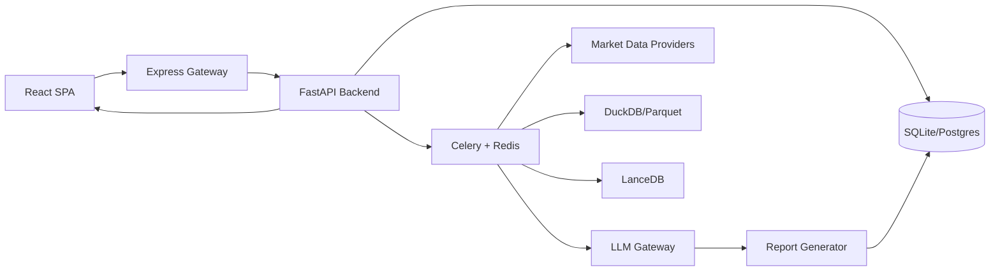

# ALSA 企业级开发治理文档

## 1. 目标

本文档把企业级技术评审结论转化为可执行开发规范，适用于 `ALSA` 的前端、Node 网关、FastAPI 后端、Celery worker、数据服务与 AI 分析链路。

当前优先级不是继续扩展功能，而是提升安全边界、可维护性、可观测性和 AI 输出稳定性。

## 2. 当前架构基线

关键入口：

- 前端入口：`src/App.tsx`
- Node 网关：`server.ts`
- FastAPI 入口：`python_service/main.py`
- API 聚合：`python_service/app/api/router.py`
- Celery worker：`python_service/app/worker.py`
- 数据库配置：`python_service/app/db/database.py`

## 3. 开发原则

### 3.1 安全默认拒绝

- 新增 API 默认需要认证。
- 公开 API 必须在代码中显式标记，并在 PR 描述中解释原因。
- 不允许新增“长列表绕过鉴权”的逻辑。
- 服务间认证使用后端注入的 service token，不能依赖前端传入。

### 3.2 敏感信息管理

- `JWT_SECRET_KEY`、`API_TOKEN`、LLM API Key、Redis/Postgres 密码必须来自环境变量或密钥管理系统。
- 生产环境不允许自动生成并写入密钥文件。
- 前端不持久化 refresh token 或长期 access token。
- 浏览器端认证优先使用 `httpOnly + Secure + SameSite` Cookie。

### 3.3 AI 输出安全

- LLM 输出默认按不可信输入处理。
- Markdown 渲染默认禁止 raw HTML。
- 如确需 raw HTML，必须使用 sanitizer allowlist，并写测试覆盖 `<script>`、`onerror`、`javascript:` URL。
- AI 结果必须有 schema 校验、fallback、错误码和 trace id。

### 3.4 模块边界

- 单文件超过 500 行必须说明原因；超过 1000 行必须拆分计划。
- 服务层只负责业务编排；渲染、数据提取、外部调用、fallback 应拆成独立模块。
- React 组件超过 500 行应拆成 container、view、hook、service。

### 3.5 可观测性

每个长链路任务必须记录：

- `trace_id`
- `job_id`
- `user_id` 或匿名主体
- provider / model / data source
- latency
- token usage
- status / error_code

长期目标是提供 Prometheus-compatible `/metrics`，而不是只保留进程内统计。

## 4. API 开发规范

新增 FastAPI 路由时：

1. 在 `python_service/app/api/<domain>.py` 创建薄路由。
2. 业务逻辑放到 `python_service/app/services/`。
3. 在 `python_service/app/api/router.py` 注册。
4. 返回统一结构：`{ success, data?, error?, code? }`。
5. 对外部依赖错误使用明确 code，例如：
   - `DATA_PROVIDER_TIMEOUT`
   - `LLM_RATE_LIMITED`
   - `MODEL_SCHEMA_INVALID`
   - `JOB_QUEUE_FULL`

## 5. 异步任务规范

Celery 任务必须满足：

- 任务开始时落库为 `running`。
- 失败时落库为 `failed`，并保存 `error_code` 与 `error_message`。
- 只对可恢复错误重试，如 429、503、timeout、connection。
- 不可恢复错误不重试，例如 schema invalid、auth failed、unsupported market。
- 新任务必须有最大并发与队列积压策略。

## 6. 数据链路规范

每个市场数据 provider 输出必须标准化：

| 字段 | 要求 |
|---|---|
| symbol | 保留市场前后缀规则 |
| market | `A-Share` / `HK-Share` / `US-Share` |
| currency | 必填 |
| timezone | 必填 |
| as_of | 数据时间戳 |
| source | 数据源名称 |
| freshness_sec | 数据新鲜度 |
| quality_score | 0-100 |

## 7. 测试要求

每个 PR 至少满足：

- `npm run lint`
- 涉及前端：相关 `vitest` 测试
- 涉及后端：相关 `pytest` 测试
- 涉及安全边界：新增 negative test
- 涉及 AI 输出：新增 schema/fallback 测试

## 8. 当前执行中的治理事项

本轮开发先落地低破坏风险事项：

1. CI 高危依赖扫描不再静默通过。
2. 移除未使用的 raw HTML Markdown 插件入口。
3. 补充本开发治理文档，作为后续重构准入标准。

## 9. 后续路线图

### 短期

- 收紧 Express 网关鉴权策略。
- 把 token 从 `localStorage` 迁移到 httpOnly Cookie。
- 给 Markdown 渲染建立统一安全组件。

### 中期

- 拆分 `report_generator_service.py`。
- 拆分大型 React dashboard 组件。
- 引入统一 Job Event Bus，减少散落轮询。

### 长期

- 建立 AI golden set 与模型准入流程。
- 引入 Prometheus/Grafana 级可观测性。
- 建立数据质量评分与回测/实盘一致性校验。
