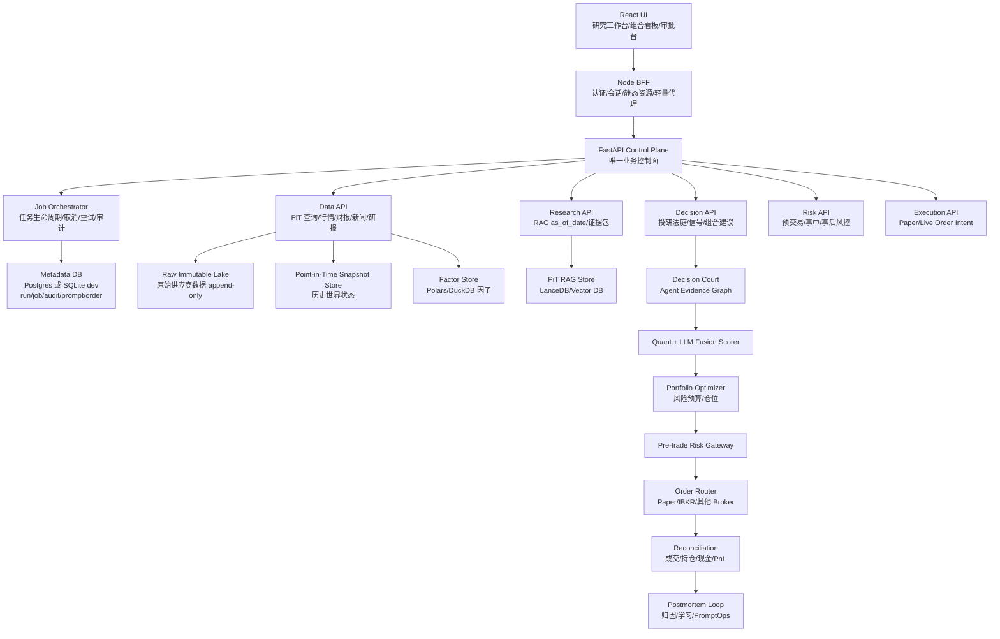
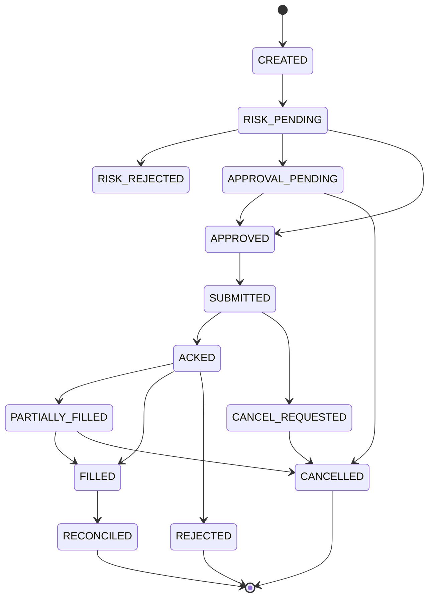

# ALSA 机构级系统演进与架构优化开发文档

> 版本日期: 2026-05-25  
> 目标版本: Institutional ALSA v1.0  
> 适用范围: 多 AI Agent 股票投研、组合决策、回测仿真、模拟盘与实盘前置风控  
> 文档定位: 面向研发落地的目标架构与开发规范, 不以当前开发难度为约束  
> 重要声明: 本系统输出仅用于投研与交易辅助, 不构成投资建议; 实盘执行必须经过合规、风控与人工授权链路。

---

## 0. 最高目标

ALSA 的最终形态不是“AI 研报生成器”, 而是一个可审计、可回放、可验证、可风控拦截的 AI-native 投资操作系统。

系统必须完成以下转变:

1. 从“当前数据 + 当前模型 + 当前搜索结果生成观点”转为“Point-in-Time 历史世界状态下的可回放研究”。
2. 从“多 Agent 角色扮演式辩论”转为“证据驱动的投研法庭与组合决策系统”。
3. 从“单票分析报告”转为“信号、组合、风险预算、交易执行、事后归因闭环”。
4. 从“LLM 直接总结结论”转为“LLM 提取非结构化证据, Quant/Risk 引擎完成数学约束”。
5. 从“可用工具”转为“符合模型风险管理、算法交易监督、市场准入风控精神的生产系统”。

终态一句话:

```text
任何一个买卖建议, 都必须能追溯到当时可见的数据、模型、Prompt、证据、风险检查、人工审批和执行结果。
```

---

## 1. 当前系统诊断基线

### 1.1 已具备的基础

当前 ALSA 已经具备机构化改造的基础:

- React + Node BFF + FastAPI 的分层架构已经存在。
- Python 后端已具备 `AnalysisJobService`, `DiscussionService`, `MarketSnapshotService`。
- 数据湖方向已经开始使用 Parquet + DuckDB + Polars。
- LanceDB 已作为研究向量库雏形存在。
- SQLite/SQLModel 已有 `AnalysisJob`, `AnalysisRun`, `AnalysisArtifact`, `PromptRun`, `AuditLog` 等基础模型。
- IBKR Client Portal 已接入账户、持仓、PnL、历史行情等读取能力。
- 多 Agent 拓扑已迁移到服务端并具备 quick/standard/deep/sector 多模式。

### 1.2 当前不能进入真实资金闭环的原因

以下问题必须视为 P0:

1. 历史数据不可证明为 Point-in-Time。当前 Parquet OHLC 以当前年份分区并写入固定 `part-000.parquet`, 不满足 append-only 与历史重放要求。
2. RAG 缺少时间边界。研究文档 chunk 没有 `published_at`, `observed_at`, `ingested_at`, `effective_at`, `source_hash`, `revision_id`。
3. 回测不是策略回测。当前回测更接近“上一次建议与当前价格比较”, 不能评估策略真实 alpha。
4. Agent 输出结构不可靠。部分核心字段仍从自然语言文本通过 regex 抽取, 且中文乱码会直接污染结论。
5. 风险等级与仓位没有被组合风控约束。最终 `risk_level` 不能硬编码, 仓位不能由 LLM 文本建议直接决定。
6. IBKR 接入缺少订单状态机与预交易风控网关。系统不能从 Agent 信号直接触发实盘订单。

---

## 2. 最优目标架构

### 2.1 总体架构



### 2.2 控制面原则

1. FastAPI 是唯一业务控制面。
2. Node BFF 不保留投研业务状态, 不编排 LLM, 不保存第二套分析数据库。
3. 前端只负责交互、展示、审批、状态轮询与导出。
4. 任何 LLM 调用必须经过服务端 `LLMGateway` 与 `PromptRuntime`。
5. 任何交易动作必须经过 `PreTradeRiskGateway`。
6. 任何可回测产物必须绑定 `as_of_date`。
7. 任何生产结论必须绑定 `run_id`, `snapshot_id`, `prompt_version`, `model_version`, `code_version`, `data_version`。

---

## 3. 业务流与数据流重塑

### 3.1 标准投研流

```text
User Request
  -> Resolve Instrument
  -> Build Point-in-Time Snapshot
  -> Run Data Quality Checks
  -> Compute Factors
  -> Retrieve PiT Research Evidence
  -> Run Agent Decision Court
  -> Quant + LLM Score Fusion
  -> Build Signal
  -> Portfolio Risk Budgeting
  -> Generate Research Report
  -> Human Review if needed
```

### 3.2 标准交易流

```text
Signal
  -> Portfolio Intent
  -> Pre-trade Risk Checks
  -> Human Approval Gate if triggered
  -> Order Intent
  -> Paper/Live Order Router
  -> Broker ACK
  -> Fill/Rejection/Partial Fill
  -> Position Reconciliation
  -> Real-time Risk Monitoring
  -> Post-trade Attribution
```

### 3.3 回测流

```text
Backtest Config
  -> Historical Universe as_of_date
  -> PiT Snapshot Replay
  -> Historical RAG Replay
  -> Frozen Prompt/Model/Code Version
  -> Signal Generation
  -> Event-driven Execution Simulator
  -> Cost/Slippage/Limit-up-down/Delisting Model
  -> Portfolio Accounting
  -> Metrics + Failure Attribution
```

---

## 4. Point-in-Time 数据平台

### 4.1 数据时间语义

所有数据必须同时区分以下时间:

| 字段 | 含义 | 示例 |
| --- | --- | --- |
| `event_time` | 事件实际发生时间 | 财报覆盖的报告期末 |
| `published_at` | 信息公开发布时间 | 交易所公告披露时间 |
| `observed_at` | 数据源观测时间 | 供应商接口返回时间 |
| `ingested_at` | 系统入湖时间 | ALSA 写入数据湖时间 |
| `effective_from` | 系统允许使用该数据的开始时间 | `max(published_at, ingested_at)` |
| `effective_to` | 该版本被新版本替代的时间 | 下一修订版本生效前 |

回测与历史 RAG 只能使用:

```sql
effective_from <= as_of_date
AND (effective_to IS NULL OR effective_to > as_of_date)
```

### 4.2 Parquet Lake 目标目录

禁止覆盖固定 `part-000.parquet`。所有数据采用 append-only + content hash。

```text
data/lake/
  raw/
    vendor=yfinance/
      dataset=ohlc/
        market=US-Share/
          symbol=AAPL/
            trade_date=2026-05-25/
              ingested_at=20260525T153012Z/
                part-<uuid>.parquet
    vendor=akshare/
      dataset=financials/
        market=A-Share/
          symbol=600519/
            report_period=2025Q4/
              ingested_at=.../
                part-<uuid>.parquet
  normalized/
    ohlc/
    financials/
    corporate_actions/
    trading_calendar/
  snapshots/
    snapshot_date=YYYY-MM-DD/
      market=.../
        symbol=.../
          snapshot_id=<id>.parquet
  factors/
    factor_date=YYYY-MM-DD/
      factor_set=v1/
        part-<uuid>.parquet
  backtests/
    backtest_id=<id>/
      signals.parquet
      fills.parquet
      positions.parquet
      equity_curve.parquet
```

### 4.3 核心数据表

#### `data_observations`

| 字段 | 类型 | 要求 |
| --- | --- | --- |
| `observation_id` | TEXT PK | 唯一 ID |
| `dataset` | TEXT | `ohlc/financials/news/filings/research` |
| `vendor` | TEXT | 数据供应商 |
| `market` | TEXT | 市场 |
| `symbol` | TEXT | 标的 |
| `event_time` | DATETIME | 事件时间 |
| `published_at` | DATETIME | 披露时间 |
| `observed_at` | DATETIME | 观测时间 |
| `ingested_at` | DATETIME | 入湖时间 |
| `effective_from` | DATETIME | 可用开始时间 |
| `effective_to` | DATETIME NULL | 可用结束时间 |
| `content_hash` | TEXT | 原始内容 hash |
| `storage_path` | TEXT | Parquet/JSON 路径 |
| `quality_score` | REAL | 0-1 |
| `revision_id` | TEXT | 数据修订版本 |

#### `point_in_time_snapshots`

| 字段 | 类型 | 要求 |
| --- | --- | --- |
| `snapshot_id` | TEXT PK | 唯一 ID |
| `as_of_date` | DATETIME | 历史视角时间 |
| `market` | TEXT | 市场 |
| `symbol` | TEXT | 标的 |
| `universe_id` | TEXT | 股票池版本 |
| `data_cutoff` | DATETIME | 数据可见截止时间 |
| `data_quality_score` | REAL | 0-1 |
| `source_manifest_path` | TEXT | 本次快照引用数据清单 |
| `snapshot_path` | TEXT | 快照文件 |
| `created_at` | DATETIME | 快照生成时间 |

### 4.4 数据质量门禁

每个 snapshot 必须输出 `DataQualityReport`:

```json
{
  "snapshot_id": "snap_xxx",
  "as_of_date": "2026-05-25T15:00:00+08:00",
  "score": 0.92,
  "blocking_errors": [],
  "warnings": [
    {
      "code": "LOW_VOLUME_SOURCE_CONFIDENCE",
      "field": "volume",
      "severity": "medium",
      "message": "Yahoo volume differs from vendor B by 8.7%"
    }
  ],
  "field_coverage": {
    "ohlc": 1.0,
    "financials": 0.74,
    "news": 0.88
  }
}
```

硬规则:

- `score < 0.70`: 禁止生成交易信号, 只允许生成数据问题报告。
- `0.70 <= score < 0.85`: 允许研究, 禁止自动进入订单意图。
- `score >= 0.85`: 允许进入标准决策流。

---

## 5. PiT RAG 与研究证据库

### 5.1 研究文档 schema

#### `research_documents`

| 字段 | 类型 | 说明 |
| --- | --- | --- |
| `doc_id` | TEXT PK | 文档 ID |
| `source_type` | TEXT | `filing/news/research/transcript/social/macro` |
| `source_name` | TEXT | 来源名称 |
| `url` | TEXT | 原始 URL |
| `title` | TEXT | 标题 |
| `author` | TEXT | 作者/机构 |
| `published_at` | DATETIME | 发布时间 |
| `observed_at` | DATETIME | 观测时间 |
| `ingested_at` | DATETIME | 入库时间 |
| `effective_from` | DATETIME | 可使用时间 |
| `effective_to` | DATETIME NULL | 失效时间 |
| `language` | TEXT | 语言 |
| `symbols` | JSON | 相关标的 |
| `content_hash` | TEXT | 正文 hash |
| `credibility_score` | REAL | 来源可信度 |
| `storage_path` | TEXT | 原文存储 |

#### `research_chunks`

| 字段 | 类型 | 说明 |
| --- | --- | --- |
| `chunk_id` | TEXT PK | chunk ID |
| `doc_id` | TEXT FK | 文档 ID |
| `symbol` | TEXT | 相关标的 |
| `chunk_text` | TEXT | 文本 |
| `embedding_model` | TEXT | 向量模型 |
| `vector` | VECTOR | 向量 |
| `published_at` | DATETIME | 继承文档发布时间 |
| `effective_from` | DATETIME | 继承文档可用时间 |
| `effective_to` | DATETIME NULL | 继承文档失效时间 |
| `credibility_score` | REAL | 来源可信度 |
| `citation` | JSON | 引用定位 |

### 5.2 RAG 查询接口

所有 RAG 查询必须显式传入 `as_of_date`:

```python
research_store.search(
    symbol="MSFT",
    query="Azure growth margin pressure",
    as_of_date="2025-10-30T16:00:00-04:00",
    source_types=["filing", "transcript", "news"],
    min_credibility=0.6,
    limit=12,
)
```

内部过滤:

```sql
symbol = :symbol
AND effective_from <= :as_of_date
AND (effective_to IS NULL OR effective_to > :as_of_date)
AND credibility_score >= :min_credibility
```

### 5.3 证据包格式

每个 Agent 不能只看到散乱搜索结果, 必须收到标准 evidence pack:

```json
{
  "as_of_date": "2025-10-30T16:00:00-04:00",
  "symbol": "MSFT",
  "evidence_items": [
    {
      "evidence_id": "ev_001",
      "source_type": "transcript",
      "title": "FY2025 Q1 Earnings Call",
      "published_at": "2025-10-29T17:30:00-04:00",
      "credibility_score": 0.95,
      "excerpt": "Management indicated Azure growth...",
      "claim_supported": "Azure growth remains above peer median",
      "risk_flags": ["management_claim", "needs_numeric_cross_check"]
    }
  ]
}
```

---

## 6. 多 Agent 决策法庭

### 6.1 从角色辩论升级为证据法庭

当前多 Agent 辩论应升级为 Decision Court。每个 Agent 是一类证据与方法论的提交方, 不是单纯“发表观点”。

目标角色:

| 角色 | 责任 | 是否可决定仓位 |
| --- | --- | --- |
| Data Auditor | 审查数据质量、PiT 合规、来源冲突 | 否, 但可阻断 |
| Fundamental Analyst | 财务质量、估值、增长、现金流 | 否 |
| Technical/Flow Analyst | 价格行为、流动性、资金流 | 否 |
| Macro Regime Analyst | 利率、汇率、信用、行业周期 | 否 |
| Catalyst Analyst | 财报、监管、产品、事件路径 | 否 |
| Bull Advocate | 构建多头假设 | 否 |
| Bear Advocate | 构建空头假设与证伪条件 | 否 |
| Quant Scorer | 因子与统计预测力评分 | 是, 只输出量化分 |
| CRO Agent | 风险约束、尾部风险、组合冲突 | 拥有否决权 |
| CIO Agent | 资本配置目标与组合层判断 | 可批准研究结论 |
| Execution Agent | 流动性、滑点、订单可执行性 | 可阻断订单 |

### 6.2 Agent 输出标准 schema

所有 Agent 输出必须是机器可校验 JSON, 禁止只输出 Markdown 观点。

```json
{
  "agent_role": "Fundamental Analyst",
  "run_id": "run_xxx",
  "snapshot_id": "snap_xxx",
  "as_of_date": "2026-05-25T15:00:00+08:00",
  "claims": [
    {
      "claim_id": "claim_001",
      "statement": "Revenue growth is decelerating but gross margin is expanding.",
      "direction": "mixed",
      "horizon": "6m",
      "confidence": 0.72,
      "evidence_ids": ["ev_001", "ev_002"],
      "numeric_support": {
        "revenue_growth_yoy": 0.08,
        "gross_margin_delta": 0.024
      },
      "falsification_condition": "Next reported gross margin falls below prior-year level.",
      "risk_flags": ["margin_reversal", "single_quarter_inference"]
    }
  ],
  "score_contribution": {
    "quality": 0.68,
    "growth": 0.54,
    "valuation": 0.42,
    "risk_penalty": 0.25
  },
  "position_impact": {
    "direction": "reduce_or_watch",
    "max_weight_delta": -0.01
  }
}
```

### 6.3 冲突仲裁

系统必须显式处理 Agent 冲突:

```text
Conflict = high_confidence_claims_with_opposite_direction
```

冲突分级:

- `C0`: 无实质冲突。
- `C1`: 解释性冲突, 不影响方向。
- `C2`: 方向冲突, 降低仓位上限 30%。
- `C3`: 事实冲突或数据冲突, 返回 Data Auditor, 禁止交易。
- `C4`: 风控冲突, CRO 直接否决。

### 6.4 决策法庭输出

```json
{
  "decision_case_id": "case_xxx",
  "symbol": "MSFT",
  "as_of_date": "2026-05-25T15:00:00+08:00",
  "verdict": "watch",
  "signal_strength": 0.41,
  "confidence": 0.63,
  "conflict_level": "C2",
  "evidence_quality": 0.86,
  "risk_penalty": 0.34,
  "recommended_action": "no_trade_watchlist",
  "position_ceiling": 0.0,
  "human_review_required": false,
  "falsification_conditions": [
    "Revenue growth re-accelerates for two consecutive quarters.",
    "Price breaks below 200-day moving average on volume expansion."
  ]
}
```

---

## 7. Quant + LLM 融合框架

### 7.1 职责边界

LLM 负责:

- 提取非结构化信息。
- 识别事件、叙事、管理层措辞、监管变化。
- 生成证据链与证伪条件。
- 解释因子结果和风险情景。

Quant 引擎负责:

- 标准化因子计算。
- 历史预测力评估。
- 组合优化。
- 风险预算。
- 回测与统计显著性。

CRO/Risk 引擎负责:

- 仓位上限。
- VaR/CVaR。
- 回撤控制。
- 流动性约束。
- 熔断与拒单。

### 7.2 信号融合公式

基础信号:

```text
RawAlphaScore =
  0.22 * QualityScore
+ 0.18 * GrowthScore
+ 0.18 * ValuationScore
+ 0.16 * MomentumScore
+ 0.12 * RevisionScore
+ 0.10 * TextCatalystScore
+ 0.04 * InsiderOrFlowScore
```

惩罚项:

```text
Penalty =
  0.30 * DataQualityPenalty
+ 0.25 * TailRiskPenalty
+ 0.20 * LiquidityPenalty
+ 0.15 * CrowdingPenalty
+ 0.10 * AgentConflictPenalty
```

最终信号:

```text
SignalStrength = sigmoid(RawAlphaScore - Penalty)
```

置信度:

```text
Confidence =
  0.35 * EvidenceQuality
+ 0.25 * HistoricalHitRate
+ 0.20 * CrossSourceAgreement
+ 0.10 * ModelStability
+ 0.10 * DataCompleteness
```

目标仓位:

```text
TargetWeight =
  min(
    SingleNameLimit,
    SectorLimitRemaining,
    LiquidityCapacity,
    RiskBudget / ExpectedShortfall
  )
  * SignalStrength
  * Confidence
  * RegimeMultiplier
```

硬限制:

```text
if DataQualityScore < 0.85:
    TargetWeight = 0

if ConflictLevel in ["C3", "C4"]:
    TargetWeight = 0

if PreTradeRiskStatus != "PASS":
    TargetWeight = 0
```

---

## 8. 回测与仿真系统

### 8.1 回测引擎要求

必须从前端轻量回测升级为后端事件驱动回测。

核心组件:

| 组件 | 职责 |
| --- | --- |
| `UniverseProvider` | 历史股票池, 包括退市与成分变化 |
| `PiTSnapshotProvider` | 按 `as_of_date` 重放历史世界状态 |
| `SignalEngine` | 使用冻结版本生成信号 |
| `ExecutionSimulator` | 模拟撮合、滑点、成本、涨跌停、停牌 |
| `PortfolioLedger` | 现金、持仓、保证金、融资成本 |
| `RiskSimulator` | 历史 VaR、压力测试、熔断 |
| `MetricsEngine` | 收益、风险、归因、稳定性 |

### 8.2 交易成本模型

成本至少包含:

- 佣金。
- 印花税。
- 交易所费用。
- 点差成本。
- 市场冲击。
- 借券成本或融资利率。
- 汇率转换成本。
- 订单未成交或部分成交。

滑点模型:

```text
SlippageBps =
  BaseSpreadBps
+ k1 * ParticipationRate
+ k2 * Volatility
+ k3 * sqrt(OrderValue / ADV)
+ k4 * StressRegimeFlag
```

### 8.3 防过拟合机制

必须内置:

1. Walk-forward optimization。
2. Purged k-fold cross validation。
3. Embargo window, 防止标签泄漏。
4. 参数冻结与 Prompt 版本冻结。
5. 样本外报告独立保存。
6. 因子 IC/Rank IC 稳定性分析。
7. 多市场、多行业、多 regime 稳健性测试。
8. Deflated Sharpe Ratio 或同等过拟合惩罚。

### 8.4 回测输出标准

```json
{
  "backtest_id": "bt_xxx",
  "config_hash": "sha256...",
  "universe_id": "univ_xxx",
  "start_date": "2018-01-01",
  "end_date": "2026-05-25",
  "metrics": {
    "cagr": 0.137,
    "volatility": 0.214,
    "sharpe": 0.74,
    "sortino": 1.02,
    "max_drawdown": -0.238,
    "turnover": 3.1,
    "hit_rate": 0.53,
    "payoff_ratio": 1.42,
    "capacity_usd": 25000000
  },
  "costs": {
    "commission": 12345.67,
    "slippage": 45231.12,
    "tax": 8210.33
  },
  "failure_modes": [
    {
      "period": "2022Q2",
      "cause": "macro_regime_shift",
      "drawdown_contribution": -0.082
    }
  ]
}
```

---

## 9. 风控前置框架

### 9.1 三层风控

#### 事前风控

- 单票最大权重。
- 行业最大权重。
- 国家/市场最大权重。
- 单日最大新增风险暴露。
- 组合 VaR/CVaR 限制。
- 最大杠杆限制。
- 单票流动性容量。
- 订单参与率上限。
- 黑名单/限制名单。
- 财报窗口期限制。
- 数据质量红灯拦截。
- Agent 冲突红灯拦截。

#### 事中风控

- 实时 PnL 监控。
- 日内最大亏损。
- 累计回撤。
- Broker API 心跳。
- 订单重复提交检测。
- 成交回报延迟检测。
- 价格偏离保护。
- 熔断与自动切只读模式。

#### 事后风控

- MAE/MFE。
- 滑点归因。
- Alpha decay。
- 持仓贡献。
- 风控拒单归因。
- Agent 错误归因。
- Prompt 与模型版本表现对比。

### 9.2 Risk Gateway 接口

```python
class PreTradeRiskRequest(BaseModel):
    portfolio_id: str
    signal_id: str
    symbol: str
    market: str
    side: Literal["BUY", "SELL", "SHORT", "COVER"]
    requested_quantity: float
    requested_notional: float
    order_type: str
    limit_price: float | None
    as_of_date: datetime
    evidence_quality: float
    data_quality_score: float
    conflict_level: str
```

输出:

```json
{
  "risk_check_id": "risk_xxx",
  "status": "REJECT",
  "blocking_rules": [
    {
      "rule_id": "DATA_QUALITY_MINIMUM",
      "message": "Data quality score 0.78 below live trading threshold 0.90"
    }
  ],
  "allowed_quantity": 0,
  "allowed_notional": 0,
  "human_review_required": true
}
```

### 9.3 Kill Switch

以下任一条件触发系统全局 kill switch:

- 当日组合亏损超过阈值。
- Broker 心跳连续失败。
- 成交回报与本地订单账本不一致。
- 数据源出现大面积异常。
- LLM Gateway 出现错误响应率飙升。
- 订单拒绝率异常。
- 风控服务不可用。
- 人工风险官手动触发。

触发后:

1. 禁止新增订单。
2. 允许撤单。
3. 允许降低风险的卖出或对冲, 但必须人工确认。
4. 所有 Agent 输出降级为研究模式。
5. 前端显示全局只读风险状态。

---

## 10. 执行与订单架构

### 10.1 订单生命周期

```text
Signal
  -> PortfolioIntent
  -> RiskApprovedIntent
  -> OrderIntent
  -> BrokerOrder
  -> BrokerAck
  -> PartialFill / Fill / Reject / Cancel
  -> ReconciledPosition
```

### 10.2 订单状态机



### 10.3 Broker Adapter

Broker Adapter 必须隔离:

- IBKR Client Portal。
- Paper trading。
- 未来其他券商。

统一接口:

```python
class BrokerAdapter(Protocol):
    async def get_account_state(self) -> AccountState: ...
    async def get_positions(self) -> list[Position]: ...
    async def submit_order(self, order: BrokerOrderRequest) -> BrokerOrderAck: ...
    async def cancel_order(self, broker_order_id: str) -> CancelAck: ...
    async def stream_fills(self) -> AsyncIterator[FillEvent]: ...
```

硬要求:

- Live adapter 默认关闭。
- 实盘必须显式 `LIVE_TRADING_ENABLED=true`。
- 实盘订单必须带 `human_approval_id`, 除非策略被明确批准为自动交易。
- 所有 adapter 响应必须落审计日志。

---

## 11. PromptOps 与模型风险管理

### 11.1 Prompt 版本治理

Prompt 不再是散落在代码中的文本。每个 Prompt 必须有:

- `prompt_version_id`
- `prompt_name`
- `role_scope`
- `template_hash`
- `schema_name`
- `allowed_tools`
- `expected_output_schema`
- `status`: `draft/canary/active/deprecated`
- `owner`
- `approval_record`

### 11.2 PromptRun 指标

每次调用记录:

- 模型。
- Provider。
- Prompt 版本。
- 输入/输出 token。
- 延迟。
- 工具调用次数。
- 结构化解析成功率。
- 引用覆盖率。
- 幻觉风险评分。
- 输出 schema validation 结果。
- 交易字段是否通过硬校验。

### 11.3 模型验证

上线前必须通过:

1. Golden set: 固定历史案例集。
2. Regression set: 已知失败案例集。
3. Adversarial set: 数据冲突、假新闻、极端行情、财报重述。
4. Out-of-sample set: 新行业/新市场。
5. Cost evaluation: token 成本、延迟、失败率。

模型不能因为“表达更像专家”上线, 只能因为以下指标改善上线:

- 结构化解析成功率。
- 证据引用准确率。
- 数据冲突识别率。
- 样本外信号质量。
- 风险遗漏率下降。

---

## 12. 服务与模块拆分

### 12.1 目标目录

```text
python_service/app/
  api/
    analysis.py
    data.py
    research.py
    decision.py
    risk.py
    execution.py
    backtest.py
    admin.py
  data/
    ingestion/
    normalization/
    point_in_time/
    quality/
    corporate_actions/
    calendar/
  research/
    documents.py
    chunking.py
    embeddings.py
    pit_retrieval.py
    evidence_pack.py
  decision/
    court.py
    schemas.py
    conflict.py
    fusion.py
    portfolio_optimizer.py
  risk/
    limits.py
    pre_trade.py
    monitoring.py
    stress.py
    kill_switch.py
  execution/
    broker_base.py
    paper_broker.py
    ibkr_broker.py
    order_state_machine.py
    reconciliation.py
  backtest/
    engine.py
    simulator.py
    costs.py
    metrics.py
    reports.py
  prompting/
    registry.py
    runtime.py
    schemas/
    templates/
    evaluators/
  observability/
    logging.py
    metrics.py
    tracing.py
```

### 12.2 服务边界

| 服务 | 输入 | 输出 | 禁止事项 |
| --- | --- | --- | --- |
| Data Service | vendor raw data | PiT snapshot/factors | 禁止覆盖历史 |
| Research Service | documents/as_of_date | evidence pack | 禁止返回未来文档 |
| Decision Service | snapshot/evidence/factors | decision case/signal | 禁止直接下单 |
| Risk Service | signal/order intent/portfolio | pass/reject/resize | 禁止调用 LLM 决定风险 |
| Execution Service | risk-approved order | broker order/fill | 禁止绕过风控 |
| Backtest Service | config/version/as_of_date | metrics/artifacts | 禁止当前数据污染 |

---

## 13. API 契约

### 13.1 创建分析任务

```http
POST /api/analysis/jobs
```

请求:

```json
{
  "symbol": "MSFT",
  "market": "US-Share",
  "as_of_date": "2026-05-25T16:00:00-04:00",
  "analysis_level": "deep",
  "mode": "research",
  "model_policy": "production_default",
  "require_pit": true
}
```

返回:

```json
{
  "job_id": "job_xxx",
  "status": "queued"
}
```

### 13.2 获取决策案例

```http
GET /api/decision/cases/{decision_case_id}
```

必须返回:

- Agent 结构化输出。
- 证据包。
- 冲突矩阵。
- Quant 分数。
- 风险扣分。
- 最终信号。
- 是否需要人工审批。

### 13.3 创建订单意图

```http
POST /api/execution/order-intents
```

硬规则:

- 请求只能来自 `risk-approved signal`。
- 禁止前端直接提交裸订单。
- 订单意图创建后必须再次通过风控。

---

## 14. 数据库目标模型

### 14.1 研究与决策

新增或重构:

- `instrument_master`
- `trading_calendars`
- `corporate_actions`
- `data_observations`
- `point_in_time_snapshots`
- `factor_values`
- `research_documents`
- `research_chunks`
- `evidence_items`
- `agent_runs`
- `agent_claims`
- `decision_cases`
- `signals`
- `signal_reviews`

### 14.2 组合与交易

新增:

- `portfolios`
- `portfolio_positions`
- `portfolio_cash`
- `risk_limits`
- `risk_check_results`
- `order_intents`
- `broker_orders`
- `fills`
- `reconciliation_runs`
- `kill_switch_events`

### 14.3 Prompt 与模型

新增或完善:

- `prompt_versions`
- `prompt_runs`
- `model_registry`
- `model_eval_runs`
- `tool_runs`
- `llm_output_validations`

---

## 15. 观测性与审计

### 15.1 必须采集的指标

系统指标:

- API 延迟。
- Job 队列深度。
- LLM 调用成功率。
- LLM 结构化解析成功率。
- 数据源成功率。
- RAG 命中率。
- 风控拒绝率。
- 订单 ACK 延迟。
- 成交回报延迟。

投研指标:

- 信号数量。
- 信号方向分布。
- Agent 冲突等级分布。
- 数据质量分数分布。
- 证据来源覆盖率。
- Prompt 版本表现。

交易指标:

- 滑点。
- 成交率。
- 拒单率。
- 换手率。
- 最大回撤。
- 风险预算使用率。

### 15.2 审计日志

以下动作必须写 `AuditLog`:

- 创建分析任务。
- 修改 Prompt 版本。
- 切换模型策略。
- 生成信号。
- 风控通过/拒绝。
- 人工审批。
- 创建订单意图。
- 提交 Broker 订单。
- 触发 kill switch。
- 修改风险限额。

---

## 16. 人类在环机制

### 16.1 自动触发人工审批的场景

- 交易金额超过阈值。
- 单票权重超过组合上限的 50%。
- 风控降仓后仍有交易需求。
- Agent 冲突等级 C2 及以上。
- 数据质量低于 0.90。
- 宏观 regime 发生切换。
- 财报/监管/黑天鹅事件窗口。
- 模型或 Prompt 版本处于 canary。
- 实盘模式。

### 16.2 审批记录

人工审批必须包含:

```json
{
  "approval_id": "appr_xxx",
  "actor_id": "user_xxx",
  "decision": "approved_with_resize",
  "approved_notional": 50000,
  "reason": "Risk limit reduced from 2% to 0.8% due to event risk.",
  "timestamp": "2026-05-25T20:30:00+08:00"
}
```

---

## 17. 安全与权限

### 17.1 权限模型

角色:

- `viewer`: 查看报告。
- `researcher`: 创建研究任务。
- `pm`: 创建组合意图。
- `risk_officer`: 审批或拒绝风控例外。
- `trader`: 提交已批准订单。
- `admin`: 系统配置。

### 17.2 密钥与实盘保护

硬规则:

- 前端不得持有任何 LLM 或 Broker 密钥。
- Live trading 默认关闭。
- 实盘开关必须同时满足环境变量、数据库配置、人工登录态三重条件。
- 生产环境禁用原始 SQL 查询接口。
- Broker certificate bypass 只能用于本地 Client Portal, 不得扩展到远程服务。

---

## 18. 测试与验收

### 18.1 必须新增测试层

| 测试 | 目标 |
| --- | --- |
| PiT Replay Test | 同一 `as_of_date` 重放结果稳定 |
| No Future Leakage Test | 回测无法读取未来新闻/财报 |
| Data Quality Test | 异常供应商数据被拦截 |
| Agent Schema Test | 所有 Agent 输出通过 schema validation |
| Conflict Arbitration Test | 方向冲突能降仓或阻断 |
| Backtest Cost Test | 成本与滑点影响计入 |
| Risk Gateway Test | 超限订单被拒绝 |
| Kill Switch Test | 风控不可用时禁止新增订单 |
| Broker Adapter Contract Test | Paper 与 IBKR adapter 行为一致 |
| Reconciliation Test | 成交、持仓、现金能对账 |

### 18.2 验收标准

v1.0 只有满足以下条件才能进入模拟盘:

1. 任意分析结果可追溯到 snapshot、Prompt、模型、数据源。
2. 回测全流程不使用当前数据。
3. 数据质量红灯能阻断信号。
4. Agent 输出 100% 经过 schema validation。
5. 所有订单意图必须经过 Risk Gateway。
6. Paper trading 账本与模拟成交一致。
7. Kill switch 可由系统与人工触发。
8. 核心链路测试覆盖 P0 风险。

进入实盘前额外要求:

1. 至少 60 个交易日 paper trading。
2. 实盘只允许小资金、低频、人工审批模式。
3. 风控官账号能一键切只读。
4. 实盘订单与 Broker 回报完成每日对账。
5. 所有异常均有审计记录。

---

## 19. 开发优先级矩阵

不考虑开发难度时, 优先级按真实资金风险排序。

### 19.1 P0: 资金安全与历史真实性

| 项目 | 目标 | 完成定义 |
| --- | --- | --- |
| PiT 数据湖 | 消除未来函数 | 所有 snapshot 支持 `as_of_date` 回放 |
| append-only Parquet | 消除历史覆盖 | 禁止 `part-000.parquet` 覆盖写 |
| PiT RAG | 消除未来文档泄漏 | RAG 查询强制 `as_of_date` |
| Risk Gateway | 阻断危险订单 | 所有订单意图必须通过风控 |
| Kill Switch | 黑天鹅保护 | 风控不可用时系统只读 |
| Agent Schema | 消除 regex 决策污染 | 交易字段全 schema 校验 |

### 19.2 P1: 策略可信度

| 项目 | 目标 | 完成定义 |
| --- | --- | --- |
| Event-driven Backtest | 替代轻量复盘 | 支持成本、滑点、停牌、涨跌停 |
| Universe History | 消除幸存者偏差 | 股票池包含退市和历史成分 |
| PromptOps | 模型输出可治理 | PromptRun 指标落库 |
| Decision Court | 证据驱动决策 | 每个结论可追溯 evidence |
| Portfolio Optimizer | 单票到组合 | 仓位由风险预算约束 |

### 19.3 P2: 生产运营

| 项目 | 目标 | 完成定义 |
| --- | --- | --- |
| Observability | 快速定位故障 | 全链路 metrics/traces/logs |
| Reconciliation | 防止账实不符 | 每日账户、订单、持仓对账 |
| Model Evaluation | 防止模型退化 | Golden/regression/adversarial eval |
| Human Approval UI | 人工在环 | 审批记录可审计 |

---

## 20. 30/60/90 天开发路线

### 30 天: 建立不可造假的投研底座

目标:

- 完成 append-only 数据湖。
- 完成 PiT snapshot。
- 完成 research document/chunk PiT schema。
- 完成 Agent JSON schema。
- 完成 DataQualityReport。

交付物:

1. `data_observations` 与 `point_in_time_snapshots` 表。
2. `ParquetMarketStore` 改为 append-only。
3. `ResearchStore.search(as_of_date=...)`。
4. `AgentOutput` Pydantic/Zod schema。
5. No future leakage 测试。

### 60 天: 建立严肃回测和决策法庭

目标:

- 完成 Decision Court。
- 完成信号融合公式。
- 完成事件驱动回测。
- 完成成本与滑点模型。
- 完成 PromptRun 指标落库。

交付物:

1. `decision_cases`, `agent_claims`, `signals` 表。
2. `decision/court.py`, `decision/fusion.py`。
3. `backtest/engine.py`, `backtest/simulator.py`。
4. Backtest report artifact。
5. Prompt/model regression eval。

### 90 天: 建立模拟盘与实盘前置风控

目标:

- 完成组合风险预算。
- 完成 Risk Gateway。
- 完成 Paper Broker。
- 完成 IBKR Adapter 状态机。
- 完成人工审批与 kill switch。

交付物:

1. `risk/pre_trade.py`, `risk/kill_switch.py`。
2. `execution/order_state_machine.py`。
3. `execution/paper_broker.py`, `execution/ibkr_broker.py`。
4. Portfolio dashboard。
5. Paper trading 60 日运行规则。

---

## 21. 关键工程决策

### 21.1 数据库

开发环境可继续 SQLite, 但目标生产环境建议 Postgres。

原因:

- 订单、风控、审批、审计需要事务一致性。
- 多用户与并发任务会压垮 SQLite 的长期可维护性。
- Postgres 更适合权限、索引、审计和迁移治理。

### 21.2 数据计算

保留:

- Parquet: 历史数据湖。
- DuckDB: 本地/批量分析查询。
- Polars: 因子计算。

升级:

- 引入数据 manifest 与 content hash。
- 引入 snapshot materialization。
- 引入 factor store versioning。

### 21.3 RAG

短期可继续 LanceDB, 但必须重构 schema。长期可按规模切换向量库, 但接口必须保持:

```python
search(symbol, query, as_of_date, source_types, min_credibility, limit)
```

### 21.4 LLM

LLM 只能是研究推理与文本结构化组件, 不是风险或订单权限组件。

---

## 22. 不允许出现的反模式

1. 回测时使用当前新闻搜索。
2. 回测时使用当前财务字段。
3. 让 LLM 直接输出最终仓位且不经公式约束。
4. 用自然语言 regex 抽取交易指令。
5. 前端直接调用生产模型。
6. 前端直接创建裸订单。
7. 风控服务失败时继续交易。
8. 覆盖历史 Parquet 文件。
9. Prompt 改动不记录版本。
10. 数据质量不合格仍输出买卖建议。

---

## 23. 参考治理框架

本系统设计应参考以下监管和治理精神:

- Federal Reserve/OCC SR 11-7: Model Risk Management。
- SEC Rule 15c3-5: Market Access Risk Management Controls。
- FINRA Algorithmic Trading Supervision。
- NIST AI Risk Management Framework。

对应到 ALSA:

| 治理要求 | ALSA 落地点 |
| --- | --- |
| 模型开发与验证分离 | Prompt/model eval 与生产运行分离 |
| 独立风险控制 | Risk Gateway 不依赖 LLM 决策 |
| 可审计 | AuditLog 覆盖研究、风险、审批、订单 |
| 交易前控制 | 所有订单必须预检查 |
| AI 风险管理 | 数据质量、幻觉检测、引用覆盖、人工在环 |

---

## 24. 最终验收定义

ALSA v1.0 机构级版本完成时, 应能回答以下问题:

1. 2023-03-15 盘前, 系统当时看到了哪些数据?
2. 某次买入建议引用了哪些新闻、财报、研报?
3. 这些证据当时是否已经公开?
4. 哪个 Prompt 版本和哪个模型生成了这个结论?
5. 哪些 Agent 反对这个结论?
6. 风控为什么允许或拒绝这笔交易?
7. 如果执行了, 预期滑点是多少, 实际滑点是多少?
8. 如果亏损, 是信号错、执行错、风险错, 还是 regime 变化?
9. 下一版 Prompt 是否真的改善了样本外表现?
10. 如果 Broker 或数据源宕机, 系统如何保护资金?

只有当这些问题都有机器可查的答案时, ALSA 才能被视为机构级系统。

