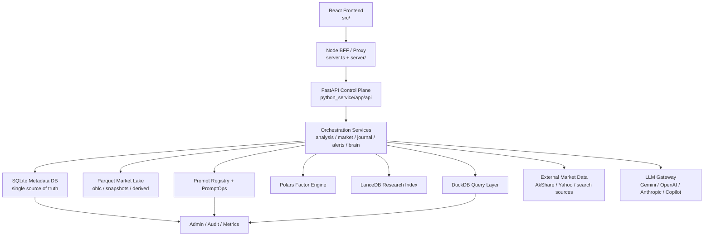
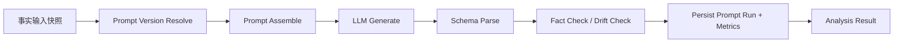

# ALSA 机构级重构研发落地蓝图

> 版本日期：2026-04-23  
> 适用对象：研发负责人、后端工程师、前端工程师、AI 应用工程师、测试与运维  
> 文档定位：面向研发落地的执行设计说明书，不是汇报稿，不是泛化架构白皮书

## 1. 文档目标

本蓝图用于把当前 ALSA 项目从“双轨并行的高功能 MVP”重构为“单主干、可审计、可持续演进的机构级金融分析系统”。本次方案聚焦六件事：

1. 统一目标架构，结束 Node 与 Python 的职责重叠。
2. 明确模块边界，结束前端直连 LLM 与后端半迁移状态。
3. 统一数据模型，结束双 SQLite、弱血缘、弱审计问题。
4. 统一 API 契约，结束 `/api/analysis` 多协议并存问题。
5. 建立 PromptOps，结束 Prompt 只在代码中堆砌、缺少版本与指标治理的问题。
6. 给出 12 周分阶段排期，使团队可以按周推进并验收。

## 2. 当前状态判断

### 2.1 当前项目定位

当前项目已经具备以下明显进展：

- Python-first 数据底座已落地：`FastAPI + SQLite + Parquet + DuckDB + Polars + LanceDB`
- 前端分析、专家讨论、报告导出、历史、提醒、Journal 等能力已部分具备
- 前后端测试体系已初步建立，前端 `vitest` 与 Python `pytest` 均可运行

但当前系统仍不属于“机构级生产系统”，主要原因不是功能太少，而是主链路没有彻底切换到统一控制面。当前真实状态是：

- 新数据栈已存在，但用户主分析链路仍主要走前端直接调用 LLM
- Node 与 FastAPI 同时承担分析职责
- 事务数据存在两套 SQLite
- Prompt 已开始模块化，但运行时治理仍缺失
- 旧代码与新架构共存，导致维护成本和定位成本持续上升

### 2.2 当前阶段最核心的问题

1. 主链路不一致：用户主分析流程没有完全切到 FastAPI job 化编排。
2. 数据不一致：Node 与 Python 分别写自己的 SQLite。
3. 契约不一致：`analysisId`、`jobId`、`job_id` 同时存在。
4. 安全边界不一致：浏览器仍可能接触模型密钥和诊断能力。
5. Prompt 运行机制不一致：Prompt Registry 只存在于测试与工具层，没有接入真实生产链路。

## 3. 重构目标

### 3.1 目标结果

12 周后，系统应满足以下结果：

- 前端只负责展示、交互、轮询，不直接编排 LLM
- Node 只保留 BFF 与静态资源职责，不再主导分析业务
- FastAPI 成为唯一分析控制面与唯一业务 API 主入口
- SQLite 成为唯一事务元数据主库
- Parquet 成为唯一历史行情与快照湖仓
- DuckDB 成为唯一 Parquet 分析查询引擎
- Polars 成为唯一指标与因子计算引擎
- LanceDB 成为唯一研究与文本检索向量引擎
- Prompt 具备版本、指标、评测、回滚能力
- 全链路具备 `run_id / snapshot_id / prompt_version / model / source / artifact` 追踪能力

### 3.2 强制设计原则

1. 业务控制面唯一：`FastAPI`。
2. 事务主库唯一：`SQLite`。
3. 历史行情与分析快照唯一湖仓：`Parquet`。
4. LLM 调用唯一入口：服务端。
5. 前端不持有生产密钥，不编排生产 Prompt。
6. 一个用户动作只允许进入一条主链路，不允许同一业务流程有双实现长期并存。
7. 所有分析结果必须可回放、可溯源、可定位到输入、Prompt、模型和数据源。

## 4. 目标架构图



## 5. 模块边界

### 5.1 前端 `src/`

前端保留以下职责：

- 搜索输入、结果展示、历史回放、讨论展示、导出交互
- Job 创建、状态轮询、错误提示
- 本地 UI 状态与用户体验逻辑

前端禁止承担以下职责：

- 不直接调用 LLM SDK
- 不直接持有或选择生产密钥
- 不拼接生产 Prompt
- 不做核心金融指标计算
- 不做研究数据拼装

### 5.2 Node BFF `server/`

Node 的目标职责：

- 本地开发入口
- 静态资源与 Vite 代理
- 统一转发 FastAPI
- 可选的认证透传与会话注入
- 与 Feishu 等外围集成的轻量桥接

Node 禁止承担以下职责：

- 不再保存分析业务主状态
- 不再维护第二套分析 SQLite
- 不再编排分析任务
- 不再承担 Prompt 运行时治理

### 5.3 FastAPI `python_service/app/api`

FastAPI 是唯一业务控制面，负责：

- Analysis Jobs
- Market Data API
- Watchlist API
- Alerts API
- Journal API
- Brain / PromptOps / Admin API

### 5.4 服务层 `python_service/app/services`

服务层拆分为以下模块：

| 模块 | 责任 | 说明 |
| --- | --- | --- |
| `analysis_job_service` | 分析任务生命周期 | 创建、执行、取消、状态更新、结果归档 |
| `market_snapshot_service` | 市场快照生产 | 行情、估值、技术指标、新闻、资金面统一快照 |
| `market_data_service` | 数据源适配与清洗 | AkShare/Yahoo/搜索引擎封装、重试、降级 |
| `research_service` | 研究文档切片与检索 | 研报、公告、新闻切片、向量化、召回 |
| `brain_manager` | 长期记忆与反馈演化 | 用户反馈、策略基因、记忆检索 |
| `prompt_runtime_service` | Prompt 组装与执行 | 角色模板、工具策略、Schema、版本绑定 |
| `report_service` | 导出与分发 | HTML、Feishu、历史归档 |

### 5.5 数据层

| 层 | 目录 | 职责 |
| --- | --- | --- |
| SQLite 元数据层 | `python_service/app/db` | 事务元数据、任务、用户、审计、Prompt 指标 |
| Parquet 湖仓层 | `python_service/app/lake` | OHLC、快照、衍生因子、分析输入快照 |
| DuckDB 查询层 | `python_service/app/lake/duckdb_engine.py` | Parquet 读查询、聚合、回放分析 |
| Polars 计算层 | `python_service/app/quant` | 指标、因子、打分 |
| LanceDB 向量层 | `python_service/app/vector` | 研究语义检索 |

### 5.6 Prompt 与 AI 层

目标边界如下：

- Prompt 模板资产迁移到服务端
- 前端只保留显示文案与角色标签，不保留生产级 Prompt 文本
- LLM Gateway 由服务端统一管理模型路由、成本、重试、风控
- Prompt Registry 与 Prompt Metrics 挂到服务端运行时

建议新增目录：

```text
python_service/app/prompting/
  registry/
  templates/
  schemas/
  evaluators/
  runtime.py
```

## 6. 数据设计

### 6.1 SQLite 统一原则

重构完成后，事务元数据只允许存在一份 SQLite，推荐根目录统一路径：

```text
data/app.db
```

Node 侧旧数据库 `data/alsa.db` 与 Python 侧 `python_service/data/app.db` 不再并存。迁移后仅保留统一主库。

### 6.2 核心表结构

#### `users`

| 字段 | 类型 | 说明 |
| --- | --- | --- |
| `user_id` | TEXT PK | 用户 ID |
| `display_name` | TEXT | 展示名 |
| `role` | TEXT | `admin/researcher/viewer` |
| `status` | TEXT | `active/disabled` |
| `created_at` | DATETIME | 创建时间 |

#### `watchlists`

| 字段 | 类型 | 说明 |
| --- | --- | --- |
| `watchlist_id` | TEXT PK | 自选列表 ID |
| `user_id` | TEXT FK | 归属用户 |
| `name` | TEXT | 列表名 |
| `created_at` | DATETIME | 创建时间 |

#### `watchlist_items`

| 字段 | 类型 | 说明 |
| --- | --- | --- |
| `item_id` | TEXT PK | 条目 ID |
| `watchlist_id` | TEXT FK | 列表 ID |
| `symbol` | TEXT | 股票代码 |
| `market` | TEXT | 市场 |
| `name` | TEXT | 股票名 |
| `tags` | TEXT | JSON 数组 |
| `notes` | TEXT | 用户备注 |
| `added_at` | DATETIME | 加入时间 |

#### `analysis_jobs`

| 字段 | 类型 | 说明 |
| --- | --- | --- |
| `job_id` | TEXT PK | 任务 ID |
| `user_id` | TEXT FK | 发起用户 |
| `symbol` | TEXT | 标的 |
| `market` | TEXT | 市场 |
| `analysis_level` | TEXT | `quick/standard/deep` |
| `status` | TEXT | `queued/running/completed/failed/cancelled` |
| `requested_model` | TEXT | 请求模型 |
| `resolved_model` | TEXT | 实际模型 |
| `prompt_version` | TEXT | Prompt 版本 |
| `snapshot_id` | TEXT | 输入快照 ID |
| `analysis_id` | TEXT | 成功后关联分析结果 |
| `error_code` | TEXT | 失败码 |
| `error_message` | TEXT | 失败信息 |
| `created_at` | DATETIME | 创建时间 |
| `started_at` | DATETIME | 开始时间 |
| `finished_at` | DATETIME | 结束时间 |

#### `analysis_runs`

| 字段 | 类型 | 说明 |
| --- | --- | --- |
| `analysis_id` | TEXT PK | 分析结果 ID |
| `job_id` | TEXT FK | 来源任务 |
| `user_id` | TEXT FK | 用户 |
| `symbol` | TEXT | 股票代码 |
| `market` | TEXT | 市场 |
| `snapshot_id` | TEXT | 输入快照 |
| `summary_verdict` | TEXT | `buy/hold/sell/watch` |
| `score` | REAL | 综合评分 |
| `risk_level` | TEXT | `low/medium/high` |
| `status` | TEXT | `completed/archived/superseded` |
| `created_at` | DATETIME | 创建时间 |

#### `analysis_artifacts`

| 字段 | 类型 | 说明 |
| --- | --- | --- |
| `artifact_id` | TEXT PK | 工件 ID |
| `analysis_id` | TEXT FK | 分析 ID |
| `artifact_type` | TEXT | `input_snapshot/output_json/report_html/discussion_log` |
| `storage_path` | TEXT | 文件路径 |
| `content_hash` | TEXT | 内容哈希 |
| `created_at` | DATETIME | 创建时间 |

#### `journal_entries`

| 字段 | 类型 | 说明 |
| --- | --- | --- |
| `journal_id` | TEXT PK | 决策日志 ID |
| `user_id` | TEXT FK | 用户 |
| `analysis_id` | TEXT FK | 来源分析，可空 |
| `symbol` | TEXT | 股票代码 |
| `market` | TEXT | 市场 |
| `action` | TEXT | `buy/sell/hold/reduce/add` |
| `price_at_decision` | REAL | 决策价格 |
| `confidence` | INTEGER | 置信度 0-100 |
| `reasoning` | TEXT | 决策理由 |
| `review_due_at` | DATETIME | 复盘时间 |
| `outcome_label` | TEXT | `win/lose/unknown` |
| `created_at` | DATETIME | 创建时间 |

#### `alerts`

| 字段 | 类型 | 说明 |
| --- | --- | --- |
| `alert_id` | TEXT PK | 提醒 ID |
| `user_id` | TEXT FK | 用户 |
| `symbol` | TEXT | 股票代码 |
| `market` | TEXT | 市场 |
| `name` | TEXT | 股票名 |
| `entry_price` | REAL | 建议入场价 |
| `target_price` | REAL | 目标价 |
| `stop_loss` | REAL | 止损价 |
| `currency` | TEXT | 币种 |
| `status` | TEXT | `active/triggered/closed` |
| `triggered_at` | DATETIME | 触发时间 |
| `created_at` | DATETIME | 创建时间 |

#### `prompt_versions`

| 字段 | 类型 | 说明 |
| --- | --- | --- |
| `prompt_version_id` | TEXT PK | Prompt 版本 ID |
| `prompt_name` | TEXT | Prompt 名称 |
| `version` | TEXT | 版本号 |
| `role_scope` | TEXT | 角色范围 |
| `template_path` | TEXT | 模板路径 |
| `schema_name` | TEXT | 输出 Schema |
| `status` | TEXT | `active/canary/deprecated` |
| `created_at` | DATETIME | 创建时间 |

#### `prompt_runs`

| 字段 | 类型 | 说明 |
| --- | --- | --- |
| `prompt_run_id` | TEXT PK | 运行 ID |
| `analysis_id` | TEXT FK | 分析 ID |
| `job_id` | TEXT FK | 任务 ID |
| `prompt_version_id` | TEXT FK | Prompt 版本 |
| `model` | TEXT | 模型 |
| `provider` | TEXT | 提供方 |
| `input_tokens` | INTEGER | 输入 token |
| `output_tokens` | INTEGER | 输出 token |
| `latency_ms` | INTEGER | 时延 |
| `parse_success` | INTEGER | 0/1 |
| `tool_calls` | INTEGER | 工具调用次数 |
| `source_coverage_score` | REAL | 数据源覆盖分 |
| `drift_score` | REAL | 漂移分 |
| `created_at` | DATETIME | 创建时间 |

#### `audit_logs`

| 字段 | 类型 | 说明 |
| --- | --- | --- |
| `audit_id` | TEXT PK | 审计日志 ID |
| `actor_id` | TEXT | 操作者 |
| `action` | TEXT | 操作名称 |
| `resource_type` | TEXT | 资源类型 |
| `resource_id` | TEXT | 资源 ID |
| `before_json` | TEXT | 变更前 |
| `after_json` | TEXT | 变更后 |
| `created_at` | DATETIME | 创建时间 |

### 6.3 Parquet 湖仓设计

Parquet 只存大对象和时间序列，不存事务元数据。

建议目录：

```text
data/lake/
  ohlc/
    market=A-Share/
      symbol=600519/
        year=2026/
          month=04/
            part-20260423T101530Z-<uuid>.parquet
  snapshots/
    market=A-Share/
      symbol=600519/
        date=2026-04-23/
          snapshot-<snapshot_id>.parquet
  derived/
    factors/
    signals/
    backtests/
```

强制规则：

1. 不允许固定覆盖 `part-000.parquet`。
2. 快照必须 append-only。
3. 每个快照必须携带 `snapshot_id`、`source`, `as_of`, `ingested_at`。
4. Parquet 文件只包含结构化事实，不包含自由文本结论。

### 6.4 DuckDB 视图设计

DuckDB 负责在 Parquet 上提供分析视图，不保存事务真相。

建议标准视图：

- `vw_latest_ohlc`
- `vw_symbol_snapshot_latest`
- `vw_factor_latest`
- `vw_alert_candidates`
- `vw_journal_review_candidates`

### 6.5 LanceDB 集合设计

建议单表 `research_chunks`，字段如下：

| 字段 | 类型 | 说明 |
| --- | --- | --- |
| `chunk_id` | TEXT | 切片 ID |
| `doc_id` | TEXT | 文档 ID |
| `symbol` | TEXT | 股票代码 |
| `market` | TEXT | 市场 |
| `doc_type` | TEXT | `news/report/announcement/history` |
| `published_at` | TEXT | 发布时间 |
| `source` | TEXT | 来源 |
| `title` | TEXT | 标题 |
| `text` | TEXT | 文本 |
| `vector` | VECTOR | 向量 |

## 7. API 契约

### 7.1 总体原则

1. API 主路径统一挂在 `/api`。
2. 所有主业务返回统一信封：

```json
{
  "success": true,
  "data": {}
}
```

失败时：

```json
{
  "success": false,
  "error": {
    "code": "ANALYSIS_JOB_FAILED",
    "message": "analysis job failed"
  }
}
```

3. 主资源 ID 统一命名：
- `job_id`
- `analysis_id`
- `snapshot_id`
- `prompt_version_id`
- `alert_id`
- `journal_id`

### 7.2 Analysis API

#### `POST /api/analysis/jobs`

用途：创建分析任务

请求：

```json
{
  "symbol": "600519",
  "market": "A-Share",
  "analysis_level": "standard",
  "requested_model": "gemini-3.1-pro-preview"
}
```

响应：

```json
{
  "success": true,
  "data": {
    "job_id": "job_01H...",
    "status": "queued"
  }
}
```

#### `GET /api/analysis/jobs/{job_id}`

用途：查询任务状态

响应：

```json
{
  "success": true,
  "data": {
    "job_id": "job_01H...",
    "status": "running",
    "progress": {
      "stage": "discussion",
      "percent": 62
    },
    "analysis_id": null
  }
}
```

#### `GET /api/analysis/runs/{analysis_id}`

用途：获取完整分析结果

响应：

```json
{
  "success": true,
  "data": {
    "analysis_id": "ana_01H...",
    "symbol": "600519",
    "market": "A-Share",
    "summary_verdict": "hold",
    "score": 78,
    "risk_level": "medium",
    "result": {},
    "artifacts": []
  }
}
```

#### `POST /api/analysis/jobs/{job_id}/cancel`

用途：取消任务

### 7.3 Market API

保留以下资源：

- `GET /api/market/quotes`
- `GET /api/market/history`
- `GET /api/market/news`
- `GET /api/market/technicals`
- `GET /api/market/search`
- `GET /api/market/news-search`

注意：

- 旧的 `/api/stock/*` 路由逐步迁移为 `/api/market/*`
- `main.py` 中遗留 endpoint 在 12 周内全部迁出或下线

### 7.4 Watchlist API

- `GET /api/watchlists`
- `POST /api/watchlists`
- `GET /api/watchlists/{watchlist_id}/items`
- `POST /api/watchlists/{watchlist_id}/items`
- `DELETE /api/watchlists/{watchlist_id}/items/{item_id}`

禁止继续使用“按 symbol 删除但本地 store 按 id 删除”的双语义设计。

### 7.5 Alerts API

- `GET /api/alerts`
- `POST /api/alerts`
- `PATCH /api/alerts/{alert_id}`
- `DELETE /api/alerts/{alert_id}`
- `POST /api/alerts/evaluate`

### 7.6 Journal API

- `GET /api/journal/entries`
- `POST /api/journal/entries`
- `PATCH /api/journal/entries/{journal_id}`
- `GET /api/journal/reviews/pending`

### 7.7 Brain API

- `GET /api/brain/context`
- `POST /api/brain/feedback`
- `GET /api/brain/policies`
- `PUT /api/brain/policies/{role}`

禁止暴露内部私有方法命名风格接口。

### 7.8 Admin API

- `GET /api/admin/stack-status`
- `GET /api/admin/prompt-metrics`
- `GET /api/admin/job-metrics`
- `GET /api/admin/audit-logs`
- `POST /api/admin/prompt-versions/{prompt_version_id}/promote`

## 8. PromptOps 设计

### 8.1 Prompt 分层

生产 Prompt 不再以一个超长字符串存在，而是拆为四层：

1. `persona layer`
2. `tool policy layer`
3. `output schema layer`
4. `review / scoring / risk layer`

### 8.2 Prompt 运行流程



### 8.3 Prompt Registry 要求

每个 Prompt 版本必须具备：

- `prompt_name`
- `version`
- `role_scope`
- `template_path`
- `schema_name`
- `status`
- `changelog`

### 8.4 Prompt Metrics

每次运行必须记录：

- `input_tokens`
- `output_tokens`
- `latency_ms`
- `parse_success`
- `tool_calls`
- `source_coverage_score`
- `drift_score`
- `manual_override`
- `user_feedback_label`

### 8.5 Prompt 发布规则

1. 新 Prompt 先进入 `canary`
2. 至少通过一轮评测集
3. `parse_success >= 95%`
4. `source_coverage_score` 不低于当前 active 版本
5. 成本上升超过 25% 时必须给出收益说明

### 8.6 Prompt 资产迁移原则

当前前端目录 `src/services/discussion/prompts/roles/` 中的生产 Prompt 资产应迁移到服务端。迁移后：

- 前端只保留角色展示文案
- 服务端持有模板、Schema、工具策略和版本元数据
- 乱码文件必须在迁移前清洗编码

## 9. 迁移策略

### 9.1 一次性决定

以下事项必须在第 1 周确定，不允许拖到中期：

1. FastAPI 是唯一分析控制面
2. Node 不再保存分析业务主状态
3. 事务主库只保留一套 SQLite
4. 前端不再直接使用生产 LLM SDK

### 9.2 兼容期策略

兼容期最多允许存在 2 周：

- Node 保留旧接口代理
- 前端允许同时存在旧 hook 与新 job hook，但新页面必须默认走新链路
- 旧路径必须打 `deprecated` 标记

### 9.3 下线清单

以下对象必须进入下线清单：

- 前端直连 `GoogleGenAI`
- Node 侧分析主编排
- 双 SQLite
- `/api/analysis/query` 原始 SQL 入口
- `/api/diagnostics/test-gemini` 公开诊断
- 前端生产 Prompt 拼接

## 10. 12 周排期

### Week 1-2：控制面统一

目标：

- 统一 `/api/analysis` 契约
- 确认 FastAPI 唯一控制面
- Node 只做代理和兼容层
- 关闭高风险 diagnostics 和 raw SQL

交付物：

- 新版 Analysis API
- Node 代理重构
- 下线清单生效
- 旧路径兼容映射表

验收标准：

- 创建分析任务只有一套协议
- 前端主入口不再区分 `analysisId/jobId/job_id`
- `/api/analysis/query` 下线

### Week 3-4：元数据与血缘统一

目标：

- 合并双 SQLite
- 建立 `analysis_jobs / analysis_runs / analysis_artifacts / prompt_runs / audit_logs`
- 血缘字段进入所有核心流程

交付物：

- 统一 SQLite schema
- migration 脚本
- artifact 落盘规则

验收标准：

- 一个分析结果可追溯到 job、snapshot、prompt_version、model、artifact

### Week 5-6：市场湖仓与查询统一

目标：

- Parquet 改为 append-only
- DuckDB 标准视图落地
- Polars 统一技术指标和基础因子计算

交付物：

- 新 Parquet 分区规则
- DuckDB query service
- Factor pipeline

验收标准：

- 最新行情、历史行情、因子结果都可从湖仓回放

### Week 7-8：用户链路迁移

目标：

- 主分析链路切换到 job 化
- Watchlist、Alerts、Journal 全部接后端主库
- 历史回放与结果查看统一走 `analysis_runs`

交付物：

- 新版前端 hooks
- 新版 watchlist / alert / journal API
- 历史回放修复

验收标准：

- 搜索、分析、保存提醒、记录决策、回看历史都走统一后端

### Week 9-10：PromptOps 与 Brain 治理

目标：

- Prompt 迁移到服务端
- Prompt Registry 与 Metrics 接运行时
- Brain API 清理私有方法依赖

交付物：

- Prompt runtime
- Prompt metrics dashboard
- Brain policy endpoints

验收标准：

- 每次分析都能查到 prompt_version 与 metrics
- 角色 Prompt 无乱码

### Week 11-12：安全、审计、稳定性

目标：

- 补齐 Admin、审计、依赖管理、CI
- 建立正式发布与回滚标准

交付物：

- Python 依赖清单
- 一键测试命令
- 审计日志查询
- 发布检查单

验收标准：

- 本地、CI、生产预发三套环境可重复部署
- 前端与 Python 测试进入统一流水线

## 11. 测试与交付标准

### 11.1 必须建立的统一命令

根目录必须提供：

```bash
npm test
.venv/Scripts/python -m pytest -q python_service/tests
```

后续应统一为：

```bash
npm run test:all
```

### 11.2 Python 依赖管理

当前仓库缺少正式 Python 依赖声明文件，这是交付风险。第 1 周必须补齐以下其一：

- `python_service/requirements.txt`
- `python_service/pyproject.toml`

推荐优先使用 `pyproject.toml`。

### 11.3 完成定义

一项重构任务只有满足以下条件才算完成：

1. 新链路已接管主流程
2. 旧链路已标记废弃或已下线
3. 有自动化测试
4. 有迁移脚本或迁移说明
5. 有可回放日志与错误码
6. 有文档更新

## 12. 关键风险与控制策略

| 风险 | 表现 | 控制策略 |
| --- | --- | --- |
| 双轨长期并存 | 新旧链路都能跑，但问题越来越难定位 | 每阶段结束必须关旧链路 |
| 数据库分裂 | SQLite 多份真相 | 第 4 周前合并主库 |
| Prompt 失控 | Prompt 越写越长、无法回滚 | Prompt Registry + canary 发布 |
| 编码污染 | 中文 Prompt 乱码导致质量下降 | 迁移前统一 UTF-8 清洗 |
| 研发只补功能不补治理 | 功能看似越来越全，但可维护性越来越差 | 每周里程碑必须含治理交付物 |

## 13. 本次文档对应的立即执行动作

按优先级排序：

1. 统一 Analysis API 契约并冻结字段命名。
2. 指定唯一 SQLite 主库路径并编写迁移脚本。
3. 将前端主分析入口迁移为 job 化轮询。
4. 移除公开 diagnostics 与 raw SQL 入口。
5. 启动 Prompt 资产服务端迁移与 UTF-8 清洗。
6. 补齐 Python 依赖声明和根目录测试脚本。

## 14. 非目标

本 12 周蓝图不追求以下内容：

- 立即拆分为多微服务
- 立即引入 PostgreSQL、Redis、消息队列等更重基础设施
- 立即做多租户 SaaS 商业化系统
- 立即做高频交易或自动下单执行系统

本阶段目标只有一个：把当前项目从“高功能实验系统”重构成“可持续交付的机构级分析平台骨架”。
