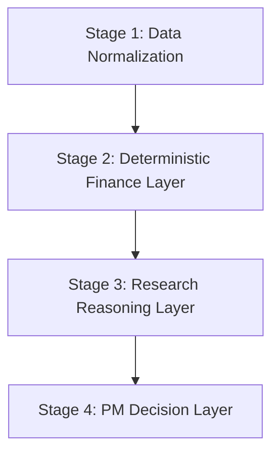

# ALSA 蓝图落地审计与 Prompt 优化文档

> 日期：2026-04-24
> 视角：高级金融分析系统架构师 + 机构级投研 Prompt 审阅
> 范围：基于当前代码库，对 2026-04-23 蓝图完成度、主链路质量、代码风险、架构一致性、Prompt 专业性进行复核，并给出优化方案

## 1. 结论摘要

当前项目已经明显从“高功能 MVP”进入“机构化迁移中版本”，但还不能判定为“已按蓝图完整收口”。

- 架构成熟度：`6.8/10`
- 蓝图落地完成度：`约 60%-65%`
- 用户主分析链路成熟度：`6.5/10`
- 多专家讨论与 Prompt 专业度：`6.0/10`
- PromptOps 成熟度：`3.5/10`

这次审计的核心结论有 4 个：

1. 初始个股分析已经迁到 `FastAPI job` 链路，这是蓝图里最重要的正向进展。
2. 多专家讨论、聊天、报告导出等深链路仍主要在前端执行 LLM 和 Prompt 运行，蓝图要求的“服务端唯一 AI 控制面”并未完成。
3. 当前后端 `analysis job` 返回结果结构与前端 `StockAnalysis` 展示契约存在高风险失配，测试通过并不代表线上真实 UI 安全。
4. Prompt 系统存在两类相反问题：初始分析 Prompt 过薄，专家讨论 Prompt 过重，而且中文 Prompt 仍有严重乱码污染。

## 2. 审计证据

本次审计已验证：

- 前端测试：`vitest 58 files / 453 tests passed`
- Python 测试：`pytest 16 passed`
- Python 测试存在较多告警，主要集中在：
  - `google.generativeai` 已弃用
  - `datetime.utcnow()` 已弃用
  - `job.json()` 已弃用

## 3. 蓝图落地完成度审计

### 3.1 已完成项

#### A. 初始分析已迁到 FastAPI Job 化

- 前端 `analyzeStock()` 已不再直接做个股首轮 LLM 生成，而是调用 `/api/analysis/jobs`，再轮询 `/api/analysis/jobs/{job_id}`，最后读取 `/api/analysis/runs/{analysis_id}`。
- 证据：
  - `src/services/analysisService.ts:24-40`
  - `src/services/analysisService.ts:58-79`
  - `python_service/app/api/analysis.py:18-32`
  - `python_service/app/api/analysis.py:34-71`

#### B. FastAPI 已成为主要业务 API 面

- `server.ts` 当前主要承担代理角色，把 `/api/analysis`、`/api/market`、`/api/watchlist`、`/api/journal` 等请求转发到 Python。
- 证据：
  - `server.ts:70-84`

#### C. Python 元数据主库方向已成型

- Python 当前默认 SQLite 路径已是 `data/app.db`，符合蓝图单主库方向。
- 证据：
  - `python_service/app/db/sqlite.py:4-8`

#### D. 血缘基础表已落地

- 已有 `AnalysisJob`、`AnalysisRun`、`AnalysisArtifact`、`PromptRun`、`AuditLog` 等模型。
- 证据：
  - `python_service/app/db/models.py:6-69`

### 3.2 部分完成项

#### A. “服务端唯一 AI 控制面”只完成了首段，没有完成全链路

- 初始分析已经走后端。
- 但聊天、讨论、报告、二次结论生成仍在前端直接创建 AI 客户端并执行 Prompt。
- 证据：
  - `src/services/analysisService.ts:87-190`
  - `src/services/discussionService.ts:148`
  - `src/services/discussionService.ts:683-810`
  - `src/services/geminiService.ts:145-156`

结论：当前是“首轮分析服务端化 + 深链路前端化”的半迁移状态，不是蓝图定义的单主干。

#### B. 单 SQLite 目标只完成了 Python 主链，Node 旧数据库仍保留

- Python 使用 `data/app.db`
- Node 旧代码仍在维护 `data/alsa.db`
- 证据：
  - `python_service/app/db/sqlite.py:4`
  - `server/db/client.ts:9-10`

结论：运行时主路径已偏向 Python，但仓库层面仍存在双库遗留和误导性维护成本。

#### C. Prompt Registry 只有代码，没有运行时接线

- `initializePromptRegistry()` 和 `recordPromptMetrics()` 只有定义，没有发现真实业务接入点。
- `useAnalysisJob()` 也是已写未接线。
- 证据：
  - `src/services/promptRegistration.ts:16-90`
  - `src/services/promptRegistry.ts:36-58`
  - `src/hooks/useAnalysisJob.ts:4-69`
  - 全仓检索仅命中定义处

### 3.3 未完成项

#### A. Node 旧分析栈未真正清退

- 旧 `server/db/client.ts`、旧分析表结构仍在仓库内，容易继续形成误接线。

#### B. Prompt 未迁到服务端统一运行

- 蓝图建议的 `python_service/app/prompting/` 运行层尚未形成主运行路径。

#### C. PromptOps 未形成版本发布、指标采样、回滚闭环

- 当前仅有轻量注册器与内存指标对象，离机构级治理还差很远。

## 4. 关键问题清单

### 4.1 P0 问题

#### P0-1 分析结果契约与前端展示契约高风险失配

后端初始分析 Prompt 当前只要求返回：

- `summary_verdict`
- `score`
- `risk_level`
- `summary`
- `quantitative_check`
- `technical_outlook`
- `actionable_insight`

证据：

- `python_service/app/services/analysis_job_service.py:133-140`

但前端 `StockAnalysis` 及展示层要求大量强依赖字段：

- `stockInfo`
- `recommendation`
- `technicalIndicators`
- `fundamentals`
- `news`

证据：

- `src/types.ts:170-220`
- `src/components/analysis/AnalysisResult.tsx:54-56`
- `src/components/analysis/StockHeroCard.tsx:205-275`
- `src/components/analysis/ConferenceResults.tsx:309-311`
- `src/components/analysis/ScorePanel.tsx:40`

当前 `analysisService.ts` 直接把后端 `result` 强转成 `StockAnalysis`：

- `src/services/analysisService.ts:78-84`

这是本次审计里最严重的结构性问题之一。它意味着：

- 后端测试通过，不代表真实前端可稳定渲染
- 讨论链路可能在 `analysis.stockInfo.symbol` 等位置直接失效
- 回归测试没有覆盖“真实 UI 契约”

#### P0-2 历史回放仍存在清空当前分析的逻辑错误

在选择历史记录时，如果该记录没有讨论数据，代码先 `setAnalysis(item)`，随后又执行 `resetAnalysis()`，会把刚选中的分析结果清空。

证据：

- `src/App.tsx:128-155`

影响：

- 历史回看链路不稳定
- 用户会误以为历史记录损坏或读取失败

#### P0-3 原始 SQL 查询接口仍然直接暴露

当前仍保留：

- `GET /api/market/lake/query`

并直接执行传入 SQL：

- `python_service/app/api/market.py:10-16`
- `python_service/app/services/query_engine.py:15-26`

这是典型的“研发便利接口未下线”问题。对于机构级系统，这会带来：

- 任意重型查询拖垮服务
- 数据暴露面过大
- 无法做受控查询、权限边界和审计

#### P0-4 浏览器仍能触达模型诊断与密钥测试链路

当前仍保留：

- `server.ts:55` 挂载 `/api/diagnostics`
- `src/services/geminiService.ts:163-213` 暴露浏览器诊断函数并请求 `/api/diagnostics/test-gemini`

这与蓝图“前端不接触生产密钥、不暴露诊断能力”的目标冲突。

### 4.2 P1 问题

#### P1-1 前端仍保存大量 AI 主逻辑

聊天、报告、多专家讨论、讨论后追问、重新生成结论都还在前端执行：

- `src/services/analysisService.ts:87-190`
- `src/services/discussionService.ts:141-825`

影响：

- 模型调用路径分散
- Prompt 与工具策略分散
- 审计、成本、回放、统一缓存都难做

#### P1-2 已写的 Job Hook 与 API Client 契约已经过时

`useAnalysisJob.ts` 仍认为后端返回 `{analysisId, jobId}`，并轮询 `/api/analysis/jobs/{analysisId}/{jobId}`。

证据：

- `src/hooks/useAnalysisJob.ts:15-26`
- `src/hooks/useAnalysisJob.ts:33-56`

实际 FastAPI 契约是：

- 创建返回 `data.job_id`
- 状态轮询为 `/api/analysis/jobs/{job_id}`
- 最终结果读取 `/api/analysis/runs/{analysis_id}`

证据：

- `python_service/app/api/analysis.py:18-71`

`analysisClient.ts` 也仍有旧字段：

- `level` 而不是 `analysis_level`
- 读取 `data.job_id` 时漏掉了外层 `data`

证据：

- `src/services/api/analysisClient.ts:8-39`

结论：这些代码虽然未接入主链，但会误导后续开发，并且一旦重新启用会立即出错。

#### P1-3 测试覆盖偏接口成功，不覆盖真实前端结构兼容

Python 端到端测试只校验了非常轻量的结果字段，如：

- `summary_verdict`
- `symbol`

证据：

- `python_service/tests/test_end_to_end_analysis.py:57-92`

但它没有验证前端依赖的 `stockInfo/fundamentals/recommendation` 等契约，因此当前测试集对真实 UI 风险感知不足。

#### P1-4 Prompt 与工具模式存在明确运行时冲突

`discussionService.ts` 自己已经写下了一个重要事实：

- 一旦启用工具，SDK 会丢掉 `responseMimeType + responseSchema`

证据：

- `src/services/discussionService.ts:234-236`
- `src/services/discussionService.ts:286-305`

但系统后续仍多次同时要求：

- 使用 `googleSearch`
- 使用 JSON Schema
- 只返回结构化输出

证据：

- `src/services/discussionService.ts:698-705`
- `src/services/discussionService.ts:735-741`
- `src/services/discussionService.ts:803-810`

这不是“Prompt 语气问题”，而是“运行时机制与输出要求互相打架”的问题。

#### P1-5 中文 Prompt 和部分中文文案仍有乱码污染

证据：

- `src/services/discussion/promptAssembler.ts:81-89`
- `src/services/discussion/promptAssembler.ts:128`
- `src/services/discussion/prompts/roles/chiefStrategist.ts:1-38`
- `src/services/discussionService.ts:79-96`
- `src/services/discussionService.ts:315-346`

影响：

- 中文用户看到异常文案
- 模型理解中文指令质量下降
- 评测结果与真实使用体验偏差极大

### 4.3 P2 问题

#### P2-1 Watchlist/Journal 的新 Hook 仍未形成闭环

- `useWatchlistSync.ts` 删除调用按 `symbol` 删除本地项
- `useDecisionJournal.ts` 仍硬编码 `market: 'A-Share'` 和 `analysisId: 'manual'`
- `sync()` 只取数据，不回写 store

证据：

- `src/hooks/useWatchlistSync.ts:45`
- `src/hooks/useDecisionJournal.ts:11-24`
- `src/hooks/useDecisionJournal.ts:17`

#### P2-2 旧 Node 数据库代码和旧分析通路仍需清仓

这部分当前不一定在线运行，但对长期维护非常不友好。

#### P2-3 Python 服务存在技术债告警

- `google.generativeai` 弃用
- `datetime.utcnow()` 弃用
- `job.json()` 弃用

证据：

- `python_service/app/services/analysis_job_service.py:6`
- `python_service/app/services/analysis_job_service.py:65-68`
- `python_service/app/db/repositories/job_repo.py:25-30`
- `python_service/app/db/repositories/job_repo.py:51-65`

## 5. 当前 Prompt 体系专业审阅

## 5.1 当前实际生效的 Prompt 分层

当前 AI Prompt 不是一套，而是至少三套：

### A. 初始分析 Prompt

- 位置：`python_service/app/services/analysis_job_service.py:117-142`
- 用途：首轮个股分析
- 特点：极简、单段、弱结构、弱来源约束

### B. 多专家讨论 Prompt

- 入口：`src/services/discussionService.ts`
- 组装器：`src/services/discussion/promptAssembler.ts`
- 角色定义：`src/services/discussion/prompts/roles/*.ts`
- 特点：角色多、约束重、含工具、含 schema、含纠错重试

### C. 报告/聊天/总结 Prompt

- 位置：`src/services/prompts.ts`、`src/services/analysisService.ts`
- 用途：聊天、报告、讨论总结等
- 特点：长 Prompt、规则很多、数据要求高，但仍在前端执行

## 5.2 Prompt 的核心专业问题

### A. 初始分析 Prompt 过薄，无法支撑机构级金融分析

当前首轮分析 Prompt 只要求给出一个摘要、分数和建议，没有要求模型建立完整投研逻辑链：

- 没有明确“先事实、再归因、再估值、再风险、再结论”的顺序
- 没有要求区分已知事实与推断
- 没有要求给出估值方法及参数来源
- 没有要求给出关键驱动变量、敏感性和场景树
- 没有要求说明结论适用时间尺度

从专业金融分析角度，这类 Prompt 更像“投顾摘要生成器”，不是“机构级研究起始层”。

### B. 多专家 Prompt 过重，角色边界混乱

以 `Chief Strategist` 为例，它被同时要求承担：

- 分歧仲裁
- 概率加权情景估值
- 分层时间维度结论
- 交易计划
- 分步建仓
- Kelly 仓位
- 退出机制

证据：

- `src/services/discussion/prompts/roles/chiefStrategist.ts:40-82`

问题在于：

- 这相当于把研究总监、PM、交易员、风控官四个角色塞给一个 agent
- 容易输出“看似完整，实则混杂”的结论
- 模型会被迫在没有充分输入的情况下制造高精度仓位与交易参数

### C. Fundamental Prompt 有预测要求，但缺预测约束

`Fundamental Analyst` 被要求给出未来三年 Revenue、Net Profit、EPS 预测：

- `src/services/discussion/prompts/roles/fundamentalAnalyst.ts:4-10`

但没有同步强制要求：

- 预测基准年
- 驱动拆分
- 乐观/基准/悲观情景
- 关键假设敏感性
- 与行业景气周期的对应关系

这会使三年预测沦为“线性延长”或“拍脑袋数字”。

### D. Technical Prompt 覆盖面较强，但与其他角色职责重叠

`Technical Analyst` 除了趋势、MACD、RSI、量价，还被要求做：

- Quant Ensemble
- 跨市场联动
- 中期价格预测

证据：

- `src/services/discussion/prompts/roles/technicalAnalyst.ts:12-32`

问题是：

- 技术分析师应聚焦市场行为与交易结构验证
- 不应与研究员、策略总监在“中期价值判断”上高度重叠

### E. Prompt 中存在显性冲突与隐性冲突

#### 显性冲突

- 有的 Prompt 写“Google Search 仅最后手段”
- 有的 Prompt 又写“Google Search 必须用于最新基本面”

证据：

- `src/services/prompts.ts:31-36`
- `src/services/prompts.ts:157-160`

#### 运行时冲突

- Prompt 要求“必须结构化 JSON”
- 同时启用 `googleSearch`
- 但运行时自己承认启用工具后 schema 会掉

证据：

- `src/services/discussionService.ts:234-236`
- `src/services/discussionService.ts:286-305`

#### 角色冲突

- `Chief Strategist` 既管结论，又管仓位，又管交易计划
- `Risk Manager`、`Professional Reviewer`、`Contrarian Strategist` 的部分职责与其重叠

### F. Prompt 内容很“全”，但不够“可执行”

`src/services/prompts.ts` 的重型 Prompt 已经涵盖：

- 数据准确性
- 场景概率
- 估值
- 风险矩阵
- Kelly
- 新闻真实性
- Source attribution

证据：

- `src/services/prompts.ts:157-160`
- `src/services/prompts.ts:791-829`

问题不在“内容少”，而在“把太多强约束塞进一次输出”：

- token 成本高
- 稳定性差
- 小模型更容易漂移
- 不同任务的失败模式互相污染

## 6. 专业金融分析视角下的 Prompt 优化方案

## 6.1 目标原则

Prompt 优化不应该继续走“越写越长”的路线，而要走“流程分层 + 角色收敛 + 结构稳定”的路线。

建议遵循 6 条原则：

1. 先事实，后判断。
2. 先结构化数据，再叙事总结。
3. 检索阶段和裁决阶段分开，不要同一轮同时追求搜索和严格 schema。
4. 角色职责不能跨 PM、交易、风控、审计多岗混装。
5. 所有三年预测、目标价、仓位建议都必须显式绑定假设。
6. 中文 Prompt 必须先完成编码治理，再谈精修。

## 6.2 建议重构为四层 Prompt 架构



### Stage 1: Data Normalization

只做：

- 行情快照标准化
- 基本面字段补齐
- 新闻去重与日期标准化
- 来源、日期、置信度打标

禁止：

- 在这一层生成投资建议

### Stage 2: Deterministic Finance Layer

尽量用代码做，而不是让 LLM 自由发挥：

- 技术指标
- 同比/环比
- 估值分位
- 风险收益比
- 情景估值公式
- 预期收益和回撤上限

### Stage 3: Research Reasoning Layer

只保留 4 个核心角色：

- `Research Analyst`
- `Fundamental Analyst`
- `Technical Analyst`
- `Risk Reviewer`

每个角色只输出：

- `thesis`
- `evidence`
- `risks`
- `confidence`
- `structured_fields`

### Stage 4: PM Decision Layer

只由一个 `Chief Strategist / PM` 负责：

- 综合前述角色
- 给出 `buy/hold/sell/watch`
- 说明适用周期
- 给出条件式操作计划
- 不再输出过度精确的“伪交易指令”

## 6.3 初始分析 Prompt 重写建议

当前首轮 Prompt 应从“七字段摘要”升级为“机构研究起始报告”，但仍保持轻量。

推荐输出骨架：

```json
{
  "stockInfo": {},
  "summary": "",
  "thesis": {
    "bull_case": "",
    "base_case": "",
    "bear_case": ""
  },
  "fundamentals": {},
  "technicalIndicators": {},
  "valuation": {
    "method": "",
    "fair_value_range": "",
    "key_assumptions": []
  },
  "risks": [],
  "catalysts": [],
  "recommendation": "",
  "confidence": 0,
  "sourceMap": []
}
```

关键要求：

- `stockInfo` 必须完整返回，满足前端 UI 基础展示
- `recommendation` 必须映射到前端已有枚举
- 估值必须注明方法和假设
- 风险与催化剂必须分开
- `sourceMap` 必须附来源和日期

## 6.4 多专家角色优化建议

### Chief Strategist

保留：

- 分歧仲裁
- 情景概率
- 综合结论

移除或弱化：

- 精细分层建仓比例
- Kelly 精算
- 过细交易执行条目

原因：

- 这些属于 PM/交易执行层，不应在研究总结层过度精确化

### Fundamental Analyst

新增强制要求：

- 每个三年预测都要写明基准年与核心驱动
- 必须提供至少一个悲观情景
- 必须说明哪些指标来自财报，哪些来自推断

### Technical Analyst

聚焦：

- 趋势阶段
- 关键价位
- 量价验证
- 技术结构是否支持或证伪基本面叙事

弱化：

- 超出职责边界的长期价值判断

### Risk Reviewer

新增统一模板：

- 风险名称
- 触发条件
- 领先指标
- 影响方向
- 对结论的修正幅度

## 6.5 Prompt 与工具调用的运行时重构

这是 Prompt 体系里最需要先改的工程问题。

建议改成两阶段：

### 阶段一：检索阶段

- 允许 `googleSearch` / DuckDuckGo / 内部搜索
- 输出自由文本或松散结构
- 目标是拿到来源、日期、原始事实

### 阶段二：裁决阶段

- 不再启用搜索工具
- 输入为阶段一已标准化的事实包
- 严格输出 JSON Schema

这样可以彻底消除当前：

- “一边要求搜索，一边要求严格 schema”

的根本冲突。

## 7. 代码与架构优化方案

## 7.1 第一优先级

### 1. 修复分析结果契约

目标：

- 后端 `/analysis/runs/{analysis_id}` 返回的数据必须完整满足 `StockAnalysis`

建议：

- 在服务端补一层 `analysis_result_mapper`
- 由 `snapshot + deterministic calculations + llm narrative` 组装最终结果
- 不允许前端靠类型断言假装兼容

### 2. 下线 `/market/lake/query`

替换为：

- 受控分析端点
- 固定视图查询
- admin-only 开关

### 3. 关闭浏览器模型诊断链路

要求：

- `testGeminiApiKey` 不再暴露给浏览器
- `/api/diagnostics/test-gemini` 只在本地开发模式启用，或直接移除

### 4. 修复历史回放 bug

- 删除 `src/App.tsx:151-155` 中对当前分析结果的误清空逻辑

## 7.2 第二优先级

### 1. 清理未接线旧代码

- `useAnalysisJob.ts`
- `analysisClient.ts`
- Node 旧 DB 客户端及旧 analysis 路径

策略：

- 要么接入并修正契约
- 要么明确删除

### 2. 把讨论、聊天、报告迁到服务端

建议新增：

- `POST /api/analysis/{analysis_id}/discussion`
- `POST /api/analysis/{analysis_id}/chat`
- `POST /api/analysis/{analysis_id}/report`

### 3. 把 Prompt Registry 真正接入运行时

最少落地：

- `prompt_version_id`
- `input_tokens`
- `output_tokens`
- `latency_ms`
- `parse_success`
- `tool_calls`
- `user_override_rate`

## 7.3 第三优先级

### 1. 清理乱码与编码污染

范围：

- 所有 `roles/*.ts`
- `promptAssembler.ts`
- `discussionService.ts`
- 中文 UI 提示文案

### 2. 替换弃用 Python API

- `google.generativeai` 迁移到当前支持的统一 LLM SDK
- `datetime.utcnow()` 改为 timezone-aware 时间
- `job.json()` 改为当前 Pydantic 推荐写法

## 8. 建议开发排期

### 第 1 周

- 修复 `StockAnalysis` 结果契约
- 修复历史回放 bug
- 下线 raw SQL 接口
- 关闭 diagnostics 测试链路

### 第 2-3 周

- 把讨论、聊天、报告迁到 FastAPI
- 建立服务端 Prompt runtime
- 清理 `analysisClient.ts`、`useAnalysisJob.ts`、Node 旧 DB 遗留

### 第 4 周

- 完成 Prompt 中文清洗
- 角色边界收敛
- 检索阶段 / 裁决阶段拆分

### 第 5-6 周

- 接入 Prompt 指标采样
- 补全 UI 契约集成测试
- 建立真实回放测试与来源追踪测试

## 9. 最终判断

从架构和研发落地角度，这个项目不是“蓝图没做”，而是“蓝图主方向做对了，但只完成了首轮切换，还没有完成收口”。

从专业金融分析角度，当前 Prompt 也不是“内容不够多”，而是：

- 初始分析过薄
- 专家讨论过重
- 角色边界过宽
- 搜索与结构化输出机制冲突
- 中文质量受乱码严重拖累

下一步最值得先做的，不是继续加更多专家和更多字段，而是：

1. 先修结果契约与运行时边界。
2. 再修 Prompt 的流程分层和角色职责。
3. 最后再做 PromptOps 的版本治理与评测闭环。

只有这样，系统才能从“功能很多”真正走向“机构级可用”。
