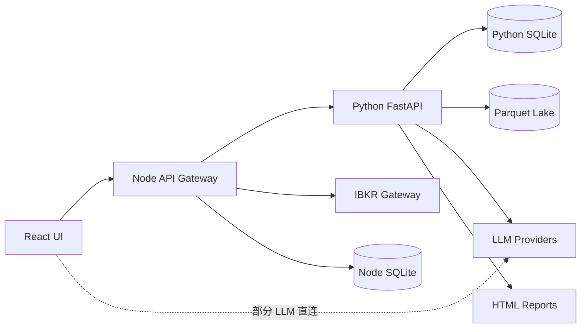
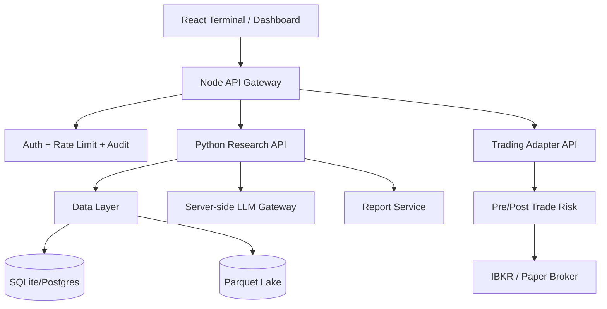
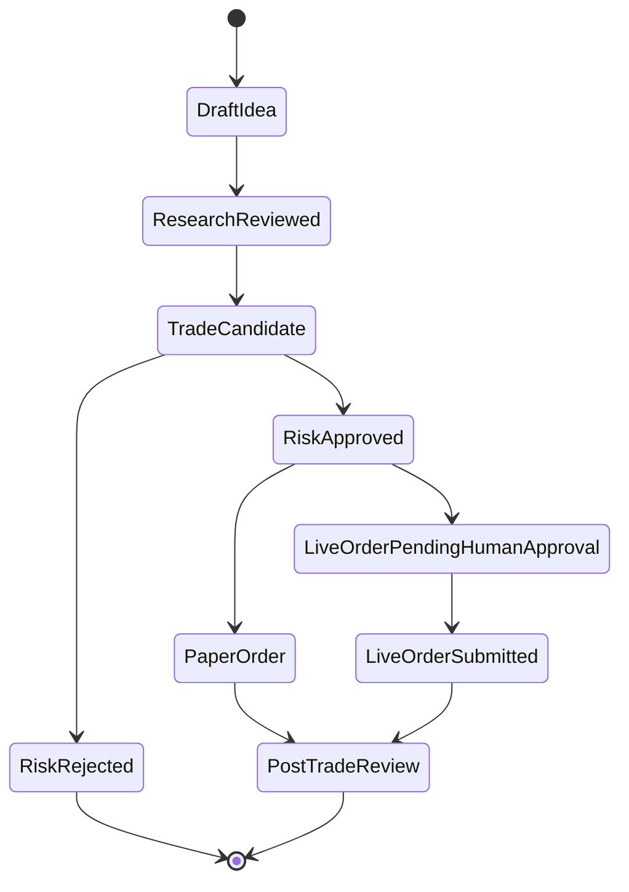

# ALSA 项目基金级审计与优化开发说明

日期：2026-06-01  
审计视角：5-10 人顶级小型私有基金公司，目标是把当前项目从“研究原型 / Demo”推进到“可用于内部投研与模拟交易的可信系统”。  
适用范围：`src/` React 前端、`server/` Node API 网关、`python_service/` FastAPI/量化服务、数据与报告资产、工程交付流程。

---

## 1. 执行摘要

当前 ALSA 已具备较强的原型能力：多市场数据接入、LLM 多专家讨论、报告生成、模拟交易、IBKR 连接、前端仪表盘和一定测试基础。对一家 5-10 人的小型私募而言，这类系统的价值在于：减少初筛时间、沉淀投研假设、复盘模型表现、把研究结论转成可执行交易计划。

但从基金实际使用标准看，当前项目仍不能进入“准生产”状态，核心原因不是功能不够，而是可信度、可审计性、安全边界和工程稳定性不足：

1. **质量门禁失效**：`npm run lint` 当前失败，说明主干存在类型错误，无法把类型检查作为合并门禁。
2. **密钥与数据边界不清**：Vite 配置把服务端密钥注入前端 bundle；Git 跟踪了数据库、Parquet、报告 HTML 等生成物。
3. **服务边界混乱**：Node API、FastAPI、前端 LLM、Python CLI 同时承担投研、数据、模型、报告、交易职责，系统可维护性下降。
4. **安全控制不足**：API、诊断路由、Socket.IO、FastAPI CORS 均偏开发态开放，缺少认证、授权、限流、审计和环境隔离。
5. **投研可信链不足**：报告强调“真实、实时、权威”，但数据源版本、引用、计算中间值、LLM prompt/version、人工确认状态未形成完整链路。
6. **交易风险控制未闭环**：已有风控、kill switch、IBKR、模拟交易模块，但未形成统一的 pre-trade/post-trade 风控闸门与不可绕过策略。
7. **文件规模过大**：多个单文件超过 40KB-110KB，说明职责集中，后续 5-10 人协作会快速失控。

建议采用 **6 周、三阶段整改**：先止血（安全与 CI）、再重构核心链路（数据/分析/报告/交易边界）、最后补齐基金运营所需的监控、审计、复盘和发布流程。

---

## 2. 基金级验收标准

小型私募团队不需要大型银行级平台，但必须满足以下最低标准：

### 2.1 投研可信标准

- 每个投资结论必须能追溯到：数据源、数据时间、计算逻辑、LLM prompt/version、人工确认人、生成时间。
- 每个关键指标必须标记质量：实时、延迟、估算、缺失、冲突。
- 每份报告必须区分：事实、模型推断、LLM 观点、人工观点。
- 所有“买入/卖出/目标价/止损”输出必须附带关键假设和失效条件。

### 2.2 交易安全标准

- 任何实盘或 IBKR 相关操作必须默认只读，写操作需显式开关、二次确认、权限校验、审计记录。
- 模拟交易和实盘交易必须共享同一套风控规则，但环境完全隔离。
- Pre-trade 风控必须不可绕过：仓位、单票、行业、流动性、价格偏离、交易时间、停牌/涨跌停、黑名单。
- Post-trade 必须记录实际成交、滑点、佣金、拒单、异常，并可用于复盘。

### 2.3 工程交付标准

- `npm run lint`、`npm test`、Python 单元测试必须可重复通过。
- 生成物、数据库、日志、密钥不得入库。
- API 必须有版本、schema、错误码和基本认证。
- 关键路径要有观测：latency、error rate、LLM cost、数据源成功率、任务失败原因。

---

## 3. 现状证据与主要问题

### 3.1 工程质量门禁

**证据**：执行 `npm run lint` 失败，当前错误包括：

- `server/__tests__/stockRoutes.test.ts`：`vi` namespace 缺失。
- `server/routes/analysisRoutes.ts`：隐式 `any`。
- `src/App.tsx`：组件 props 不匹配。
- `src/components/dashboard/InstitutionalAlertPanel.tsx`：number/string 类型不匹配。
- `src/hooks/useAnalysisJob.ts`：状态字典索引类型不安全。
- `src/services/geminiService.ts`：不可达枚举比较。
- `src/services/quantitativeModeling.ts`：对象传给 number 参数。

**风险**：

- 主干不可验证，CI 即使配置也无法阻止回归。
- 类型错误集中在分析任务、提醒面板、模型服务、量化建模，都是核心业务路径。
- 团队规模扩大到 5-10 人后，缺乏门禁会导致“每人都能跑、集成就坏”。

**整改要求**：

- P0：修复所有 TypeScript 类型错误，`npm run lint` 必须为合并门禁。
- P0：把测试环境类型引入 `tsconfig` 或 `vitest` 配置，禁止测试文件依赖隐式全局。
- P1：对核心 API response 使用 `zod` 或 Pydantic schema 做运行时校验。

---

### 3.2 版本控制与敏感数据

**证据**：虽然 `.gitignore` 已声明忽略 `data/`、`python_service/data/`、`*.db`、`*.parquet`、`reports/`，但当前 Git 仍跟踪：

- `data/alsa.db`
- `python_service/data/app.db`
- `python_service/data/lake/.../*.parquet`
- `reports/*.html`
- `reports/sector/.../*.html`

此外根目录存在 `.env`、`keys.txt`、日志文件等高风险文件，虽未确认全部被跟踪，但项目结构说明当前密钥/运行态文件管理不严格。

**风险**：

- 投研报告、模拟交易记录、客户/账户信息、行情快照可能被提交。
- 数据库 schema 与真实数据混在一起，迁移和复现实验困难。
- 后续接入真实券商/客户数据后，合规风险迅速放大。

**整改要求**：

- P0：从 Git index 移除已跟踪生成物：数据库、Parquet、报告、日志、缓存。
- P0：增加 `scripts/audit-repo-hygiene`，扫描入库敏感文件和大文件。
- P0：引入密钥扫描，如 `gitleaks` 或等价工具。
- P1：建立 `data/samples/`，只保留脱敏、小规模、可复现的样本数据。
- P1：报告 HTML 改为运行产物；如需示例报告，放入 `docs/examples/` 并脱敏。

---

### 3.3 密钥暴露与前后端边界

**证据**：`vite.config.ts` 中存在：

- `process.env.GEMINI_API_KEY` 注入前端构建。
- `process.env.DEEPSEEK_API_KEY` 注入前端构建。

`src/services/llmProvider.ts` 还尝试读取 `VITE_OPENAI_API_KEY`、`VITE_ANTHROPIC_API_KEY` 并从浏览器直接调用第三方 LLM。

**风险**：

- 服务端 API key 可能被打包进浏览器代码。
- 用户浏览器直接调用 LLM，无法统一限流、审计、成本控制、prompt 版本管理。
- 基金内部系统无法满足“谁在何时因何调用了哪个模型”的审计要求。

**整改要求**：

- P0：删除 Vite `define` 中所有服务端密钥注入。
- P0：禁止前端直接持有第三方 LLM key。前端只调用后端 `/api/llm/*` 或 `/api/analysis/*`。
- P1：统一 LLM Gateway：模型路由、重试、超时、成本、prompt 版本、响应校验、日志脱敏全部在服务端完成。
- P1：增加 per-user/per-session 调用配额与熔断。

---

### 3.4 API 与网络安全

**证据**：

- `server.ts` 监听 `0.0.0.0:3000`。
- `server.ts` Socket.IO CORS 为 `origin: '*'`。
- `python_service/main.py` FastAPI CORS 为 `allow_origins=['*']` 且 `allow_credentials=True`。
- `/api/diagnostics` 挂载在主 API 下，未看到统一认证。
- `server/lib/ibkrClient.ts` 对 IBKR Gateway 使用 `rejectUnauthorized: false`。

**风险**：

- 开发机局域网暴露 API 与诊断接口。
- 任意来源可连接 Socket.IO，潜在泄露任务状态、日志、报告生成过程。
- 诊断接口若可读取日志/配置，会泄露密钥、prompt、账户或交易信息。
- 自签证书跳过校验可接受于本地 IBKR Gateway，但必须强约束只允许 loopback，不能泛化到远程网关。

**整改要求**：

- P0：默认只监听 `127.0.0.1`；生产部署由反向代理控制外部访问。
- P0：所有 `/api/*` 加最小认证：本地 token、session 或 OAuth，至少区分 admin/read-only。
- P0：诊断路由仅在 `NODE_ENV !== 'production'` 或 `ENABLE_DIAGNOSTICS=true` 且 admin 权限时开启。
- P0：Socket.IO 限制 origin，并加入连接认证。
- P1：引入 `helmet`、API rate limit、request id、结构化日志脱敏。
- P1：IBKR Gateway URL 限制为 localhost 默认；远程地址必须显式 allowlist。

---

### 3.5 服务架构与职责边界

当前实际结构类似：



**主要问题**：

- Node 和 Python 都有数据库、分析、报告、市场数据逻辑。
- 前端、Node、Python 都有 LLM 调用/配置痕迹。
- `/api/analysis` 在 Node 和 FastAPI proxy path 中同时出现，容易产生路由覆盖和行为不一致。
- 文件职责过大，单文件如 `report_generator_service.py`、`ConferenceResults.tsx`、`expert_tools.py`、`expertPrompts.ts`、`discussion_service.py` 均过大。

**目标架构**：



**整改要求**：

- P0：明确 Node 只做 API gateway/BFF，不承载核心投研算法。
- P1：统一 `/api/v1/*` 路由命名，消除 Node 与 FastAPI 的同名路径冲突。
- P1：把报告生成、专家讨论、数据快照、交易风控拆成独立服务模块。
- P2：将 SQLite 升级为 Postgres 或 DuckDB/Postgres 混合，至少在生产-like 环境避免多 SQLite 分裂。

---

### 3.6 数据质量与投研可信链

当前 prompt 和文档已经强调数据权威性，但系统层缺少强制机制。基金使用时，最危险的不是“没有观点”，而是“观点看起来专业但不可验证”。

**关键缺口**：

- 缺少统一 `DataSnapshot`：行情、财务、宏观、新闻、行业数据没有强制绑定 `source`、`as_of`、`retrieved_at`、`quality_score`、`license`。
- 缺少 `AnalysisRun` 完整 lineage：prompt 版本、模型版本、数据快照 ID、工具调用、解析错误、人工 override 未闭环。
- LLM 输出 JSON 虽有 schema 尝试，但未形成“校验失败-修复-降级-拒绝生成投资建议”的强约束。
- 报告中没有统一标注事实/推断/观点/建议。

**整改要求**：

定义最小可信数据模型：

```ts
type DataQuality = 'verified' | 'delayed' | 'estimated' | 'conflicting' | 'missing';

type DataPoint = {
  key: string;
  value: number | string | boolean | null;
  unit?: string;
  source: string;
  sourceUrl?: string;
  asOf: string;
  retrievedAt: string;
  quality: DataQuality;
  confidence: number;
};

type AnalysisLineage = {
  runId: string;
  symbol: string;
  market: string;
  snapshotId: string;
  promptVersion: string;
  modelProvider: string;
  modelName: string;
  modelVersion?: string;
  generatedAt: string;
  schemaVersion: string;
  humanReviewer?: string;
  approvalState: 'draft' | 'reviewed' | 'approved' | 'rejected';
};
```

执行规则：

- P0：报告页必须展示 `snapshotId`、`asOf`、`modelName`、`promptVersion`。
- P1：关键投资建议若数据质量为 `conflicting` 或 `missing`，必须降级为“需人工复核”，不能给出强买卖结论。
- P1：每次分析保存完整 input/output，不保存未脱敏密钥或敏感 header。
- P2：建立“结论命中率/目标价偏差/止损触发/专家权重”复盘表。

---

### 3.7 LLM 系统与 Prompt 治理

**主要问题**：

- Prompt 分散在前端 TS、Python 模板和服务代码中，版本与运行记录不统一。
- 部分文档出现乱码，说明编码和文档生成流程不稳定。
- 多模型 fallback 缺少成本、质量、延迟和 schema 成功率维度的调度。
- “多专家讨论”容易制造一致性幻觉：多个 AI 角色并不等于多源独立验证。

**整改要求**：

- P0：所有生产 prompt 迁移到服务端 prompt registry，前端不得拼接核心投资 prompt。
- P1：Prompt 必须有 `id/version/owner/changeLog/evalSet/rollbackVersion`。
- P1：LLM 输出必须经过结构化解析、字段校验、事实引用检查；失败时进入 retry-with-repair，仍失败则标记为不可用。
- P1：为每类任务定义模型策略：
  - 快速初筛：低成本模型，严格 schema。
  - 深度报告：高质量模型，强制数据快照与引用。
  - 交易建议：必须经过规则引擎 + 人工确认。
- P2：建立 prompt eval 数据集：A 股、港股、美股、周期、成长、金融、事件驱动、财报后样本各不少于 10 个。

---

### 3.8 交易、风控与组合管理

**现状**：已有 IBKR 路由、模拟交易、风险指标、kill switch、pre-trade 模块痕迹，这是正确方向。但基金可用系统必须强调“不可绕过”。

**主要缺口**：

- 投研信号、交易计划、模拟交易、IBKR 操作之间缺少统一状态机。
- 未明确区分 read-only broker data、paper order、live order。
- 缺少交易前风险审批与交易后复盘闭环。

**建议状态机**：



**整改要求**：

- P0：任何 live order 功能默认关闭，需 `ENABLE_LIVE_TRADING=true`、admin 权限、二次确认。
- P0：IBKR 路由加只读/写入权限隔离。
- P1：实现 `TradeIntent` 表，字段包含 symbol、direction、size、thesis、riskLimit、sourceAnalysisRunId、approvalState。
- P1：Pre-trade 风控输出标准化：pass/fail/warn、规则 ID、阈值、实际值、审批人。
- P2：组合层风险：净敞口、行业集中度、单票权重、相关性、VaR/回撤、流动性天数。

---

## 4. 优化开发路线图

### 阶段 0：止血与可验证主干（第 1 周）

目标：让项目回到可安全开发、可重复验证、不会泄露密钥/数据的状态。

**任务 0.1：修复质量门禁**

- 修复 `npm run lint` 全部错误。
- 补齐 Vitest 全局类型配置。
- 在 CI 中加入 `npm run lint`、`npm test`。
- 验收：本地和 CI 均通过。

**任务 0.2：清理版本控制污染**

- 从 Git index 移除已跟踪的 `data/`、`python_service/data/`、`reports/`、`*.db`、`*.parquet`。
- 保留脱敏样本到 `docs/examples/` 或 `fixtures/`。
- 增加敏感文件扫描脚本。
- 验收：`git ls-files` 不再出现数据库、Parquet、运行报告、日志。

**任务 0.3：阻断前端密钥泄露**

- 删除 Vite `define` 中的 LLM key 注入。
- 删除/禁用浏览器端直接 LLM provider key 读取。
- 所有 LLM 请求改走服务端。
- 验收：构建产物中搜索不到任何 API key 环境变量名和值。

**任务 0.4：最小 API 安全**

- 增加 `API_TOKEN` 或 session middleware。
- 限制 CORS 和 Socket.IO origin。
- 诊断路由默认关闭。
- 默认监听 `127.0.0.1`。
- 验收：无 token 请求核心 API 返回 401；诊断路由生产环境不可访问。

---

### 阶段 1：核心链路可信化（第 2-3 周）

目标：把“会生成报告”提升为“可追溯、可复核、可复盘的投研系统”。

**任务 1.1：统一 AnalysisRun 与 DataSnapshot**

- 新增/规范 `analysis_runs`、`data_snapshots`、`analysis_artifacts`。
- 每次分析保存 snapshot ID、prompt version、model、schema version、状态、错误。
- 报告必须展示 lineage 信息。
- 验收：任意报告可追溯到原始数据快照和模型调用记录。

**任务 1.2：LLM Gateway 服务端化**

- 统一 Node/Python LLM 调用入口，建议以 Python Research API 为主。
- 增加 timeout、retry、fallback、cost tracking、schema validation。
- 响应和错误日志脱敏。
- 验收：所有模型调用均生成审计记录；schema 失败不会直接进入报告。

**任务 1.3：数据质量标签**

- 数据服务输出统一 `DataPoint`。
- 对缺失、冲突、过期数据打标。
- 投资建议根据数据质量自动降级。
- 验收：构造缺失/冲突数据时，报告展示警告并禁止强结论。

**任务 1.4：报告组件拆分**

- 拆分超大报告生成与前端展示组件。
- 前端只负责渲染结构化 sections，不内嵌业务推断。
- Python 报告模板拆成布局、图表、风险、估值、lineage、appendix。
- 验收：单文件原则上不超过 500-800 行；核心函数可单测。

---

### 阶段 2：交易与运营闭环（第 4-6 周）

目标：形成适合小型基金内部使用的“研究-交易-复盘”闭环。

**任务 2.1：TradeIntent 与审批流**

- 引入交易意图对象，不允许报告直接变订单。
- 明确 Draft/Reviewed/RiskApproved/Submitted/PostReviewed 状态。
- 增加人工审批字段和审计日志。
- 验收：没有 approval 的交易意图不能进入 broker adapter。

**任务 2.2：Pre-trade Risk Gateway**

- 统一模拟和实盘风控。
- 规则配置化：单票上限、行业上限、组合回撤、价格偏离、流动性、黑名单。
- 每条规则输出机器可读结果。
- 验收：风险失败时无法提交订单；warning 需要人工确认。

**任务 2.3：Post-trade 与模型复盘**

- 记录信号后的 1D/5D/20D/60D 表现。
- 记录目标价命中、止损触发、最大不利波动、最大有利波动。
- 专家角色按历史表现动态权重，但必须防止过拟合。
- 验收：每周可生成投研质量复盘报告。

**任务 2.4：观测与运维面板**

- 指标：API latency、error rate、数据源成功率、LLM cost、任务成功率、报告生成耗时、broker 状态。
- 日志：request id、run id、user id、symbol、market、error code。
- 告警：数据源失败、LLM 成本异常、交易风控拒绝、IBKR 断连。
- 验收：团队负责人能在 5 分钟内定位一次分析失败原因。

---

## 5. 推荐任务拆分与负责人配置

适合 5-10 人团队的分工：

| 角色 | 人数 | 负责范围 |
|---|---:|---|
| Tech Lead / Quant Engineer | 1 | 架构边界、数据模型、风控状态机、代码评审 |
| Frontend Engineer | 1-2 | Dashboard、报告渲染、任务状态、权限态 UI |
| Backend Engineer | 1-2 | Node Gateway、FastAPI、认证、API schema、审计 |
| Quant/Data Engineer | 1-2 | 数据源、快照、指标计算、回测/复盘 |
| AI/Prompt Engineer | 1 | Prompt registry、LLM eval、schema repair、成本控制 |
| PM/Investment Reviewer | 1 | 投研流程、验收样本、报告质量、人工审批 |

小团队不建议按“前端/后端/AI/量化”完全割裂，应围绕三条价值流推进：

1. **研究链路**：数据快照 → 专家讨论 → 结构化结论 → 报告。
2. **交易链路**：研究结论 → 交易意图 → 风控 → 模拟/实盘 → 复盘。
3. **平台链路**：认证 → 审计 → 监控 → CI/CD → 数据治理。

---

## 6. 具体 Backlog

### P0：必须立即处理

1. 修复 TypeScript lint 错误。
2. 移除 Git 跟踪的数据库、Parquet、报告、日志。
3. 删除前端构建中的服务端密钥注入。
4. 禁止浏览器直连第三方 LLM key。
5. 关闭或保护 `/api/diagnostics`。
6. 限制 CORS、Socket.IO origin、API 监听地址。
7. 为 API 增加最小认证与请求审计。
8. 明确 live trading 默认关闭。

### P1：两到三周内处理

1. 统一 `/api/v1` 路由与 OpenAPI/schema。
2. 建立 `AnalysisRun`、`DataSnapshot`、`AnalysisArtifact`。
3. 服务端 LLM Gateway 标准化。
4. 数据质量标签进入报告和决策逻辑。
5. 拆分超大文件，优先处理报告生成、专家讨论、市场数据、前端报告组件。
6. 建立 prompt registry 与 eval 集。
7. 建立 pre-trade 风控标准输出。
8. CI 加入单元测试、类型检查、敏感扫描。

### P2：六周内处理

1. TradeIntent 审批流。
2. Post-trade 复盘与专家权重追踪。
3. 组合风险面板。
4. 迁移到更可靠的持久化方案，或至少统一 SQLite schema 与迁移。
5. 完成观测面板和告警。
6. 建立发布流程：dev/staging/prod-like。

---

## 7. 验收清单

### 安全验收

- [ ] 构建产物不包含任何 LLM/Broker API key。
- [ ] 无 token 无法访问核心 API。
- [ ] 诊断接口生产环境默认关闭。
- [ ] Socket.IO 拒绝非允许 origin。
- [ ] Git 不跟踪数据库、报告、日志、Parquet、密钥。

### 工程验收

- [ ] `npm run lint` 通过。
- [ ] `npm test` 通过。
- [ ] Python 单元测试通过。
- [ ] CI 可重复执行并阻止失败合并。
- [ ] 核心 API 有 schema 和错误码。

### 投研验收

- [ ] 任意报告可追溯到数据快照、prompt 版本、模型版本。
- [ ] 数据缺失或冲突时，报告显示风险并降级建议。
- [ ] LLM schema 校验失败不会生成正式报告。
- [ ] 报告区分事实、推断、观点、建议。

### 交易验收

- [ ] live trading 默认关闭。
- [ ] 所有交易意图必须经过风控。
- [ ] 风控失败不可提交订单。
- [ ] 所有订单相关操作有审计日志。
- [ ] 模拟交易和实盘交易环境隔离。

---

## 8. 建议优先改动文件

第一批建议落点：

- `vite.config.ts`：移除密钥注入，收紧 dev server 暴露面。
- `server.ts`：认证、CORS、Socket.IO origin、诊断路由开关、监听地址配置。
- `server/debugRoutes.ts`：增加 admin guard，日志脱敏。
- `src/services/llmProvider.ts`：删除浏览器端第三方 key 调用，改成后端 API client。
- `server/llmGateway.ts` / `python_service/app/services/llm_gateway.py`：二选一收敛为主 gateway，另一个作为 adapter 或废弃。
- `python_service/main.py`：CORS 收紧、认证依赖、request id、错误处理。
- `python_service/app/services/discussion_service.py`：输出 lineage、schema validation、失败降级。
- `python_service/app/services/report_generator_service.py`：拆分模板与业务逻辑。
- `src/components/analysis/ConferenceResults.tsx`：拆分展示组件，避免超大组件继续膨胀。
- `.gitignore` + Git index：清理已跟踪运行产物。

---

## 9. 实施顺序建议

最稳妥的顺序：

1. **先修门禁**：修复 lint/test，否则任何重构都不可控。
2. **再止泄露**：密钥、数据库、报告、诊断路由先处理。
3. **再统一 LLM**：前端不直连模型，所有调用服务端审计。
4. **再建 lineage**：没有 lineage 的报告不进入正式投研流。
5. **再做交易闭环**：交易必须晚于风控和审批流。
6. **最后做性能和体验**：避免在不可信基础上优化 UI。

---

## 10. 结论

ALSA 的功能野心和原型覆盖面已经超过普通投研 Demo，但基金级系统的关键不是“能生成更多内容”，而是“少生成错误内容、能解释每个结论、能阻止危险操作、能复盘每次判断”。

当前最应该投入的不是继续增加专家角色或报告章节，而是把安全、数据 lineage、质量门禁、服务边界和交易风控做扎实。完成本文 P0/P1 后，项目才适合进入小范围内部投研试用；完成 P2 后，才适合讨论接近生产的模拟交易与受控实盘辅助。

---

## 11. ???????2026-06-02?

???? TDD ?? P0 ???????????????

### 11.1 ???

- **????**?`npm run lint` ????TypeScript ????????
- **????**?`npm test` ?????? 67 ??????469 ????????
- **????**??? Git index ??????Parquet??????`keys.txt` ????/???????????????
- **????????**??? `npm run audit:repo`??? `data/`?`python_service/data/`?`reports/`????????Parquet?`.env`?`keys.txt` ??????
- **????????**???? `vite.config.ts` ? `process.env.GEMINI_API_KEY` ? `process.env.DEEPSEEK_API_KEY` ???????????
- **Node API ??????**??? `server/securityConfig.ts`????? `127.0.0.1`??? `PORT`/`HOST` ???
- **????????**?`/api/diagnostics` ?? `ENABLE_DIAGNOSTICS=true` ????
- **API token ??**???? `API_TOKEN` ?? test ?????? `/api/*` ???? Bearer token???????????
- **Socket.IO Origin ??**?????? `http://localhost:5173` ? `http://127.0.0.1:5173`???? `ALLOWED_ORIGINS` ???
- **TDD ????**??? security config?Vite key injection?repo hygiene?quantitative baseline?reflection legacy compatibility ????

### 11.2 ????

????????? P1/P2????????

- **??????**?Node/FastAPI/???????????????? `/api/v1` ? LLM gateway ???
- **AnalysisRun/DataSnapshot lineage**??????????? snapshot?prompt version?model version?schema version?
- **?????????**?????/?????????????????
- **???????**?`TradeIntent`??????pre-trade/post-trade ???????????
- **?????**??????????????????????????????
- **???????**?????? token guard???????? RBAC/OAuth/session?
- **Python FastAPI CORS/??**??????? Node gateway?Python ?????????

### 11.3 ???????2026-06-02?

??????????????????????????

- **Python FastAPI CORS/??**?`python_service/app/security.py` ?? allowlist CORS ? `API_TOKEN` ???`python_service/main.py` ??? `/api` ?????
- **??? API ??**?Node BFF ?? `/api/v1` ???????????? `/api` ???FastAPI ??? `trade-intents` ? legacy `stock/comprehensive_financials`?
- **?? LLM ????**?`src/services/llmProvider.ts` ?????????????? key????? OpenAI/Anthropic?fallback ?? `/api/llm/fallback` ?????
- **AnalysisRun/DataSnapshot lineage**??? `DataSnapshot` ???AnalysisRun prompt/model/schema/approval ???`AnalysisArtifact` lineage ??????? `/api/analysis/runs/{analysis_id}/lineage`?
- **??????????**??? `classify_data_quality` ? `should_downgrade_recommendation`?? missing/conflicting ??????????? `Needs Review`?
- **TradeIntent ????**??? `TradeIntent` ?? `/api/trade-intents` ????????????????????????? `ENABLE_LIVE_TRADING=true` ???
- **Pre-trade ????**?TradeIntent ??????? `PreTradeRiskGateway`?????? intent ?????
- **????**??? Python ???lineage??????TradeIntent API ??????? API boundary ???
- **?????**??? DeepSeek key ?????DuckDB execute ? mock??????? job ????????????OHLC ??????

### 11.4 ?????????

- **?????**?????????????????????????????????????lineage????API ????????

### 11.5 ??????

- `npm run lint`????
- `npm test`????68 ??????471 ????
- `npm run audit:repo`????
- `python -m pytest python_service/tests -q`????147 ? Python ???


---

## 12. Background Simulation / Health Check Update (2026-06-02)

### 12.1 Additional Defects Found

- Browser source still contained server-secret fallback paths: `process.env.GEMINI_API_KEY`, `process.env.DEEPSEEK_API_KEY`, `VITE_GEMINI_API_KEY`.
- Browser UI still called `/api/diagnostics/*` for env mutation, bridge generation, and diagnostic key tests.
- LLM model-list probing could call provider REST endpoints directly from browser code.
- Python test teardown emitted a Windows fatal access violation stack through eager `mem0 -> qdrant_client -> fastembed -> onnxruntime` imports.
- `restart_uvicorn.sh` and README examples still advertised binding FastAPI to `0.0.0.0`.
- IBKR client accepted self-signed TLS for any configured gateway URL, not only localhost.

### 12.2 Fixes Applied

- Added TDD boundary checks in `src/test/apiBoundary.test.ts` to fail on browser-side provider secrets and diagnostics routes.
- Removed front-end env key prefill from `src/stores/useConfigStore.ts` and `src/vite-env.d.ts`.
- Removed browser diagnostics/env update calls from `src/components/SettingsModal.tsx`.
- Routed Gemini bridge generation and model registry access through Node `/api/llm/generate` and `/api/llm/models`.
- Extended `server/routes/llmRoutes.ts` with safe backend-owned LLM generate/model endpoints.
- Kept tests deterministic with a test-only dummy key path that does not expose production env secrets to browser bundles.
- Deferred `mem0` import in `python_service/app/services/brain_manager.py` and disabled vector memory during pytest, eliminating the onnxruntime teardown crash.
- Changed FastAPI run examples/scripts to bind `127.0.0.1` by default.
- Restricted IBKR self-signed TLS bypass to localhost gateways; remote gateways require valid TLS unless explicitly allowed.

### 12.3 Final Validation Results

- `npm run lint`: PASS.
- `npm test`: PASS, 68 test files / 473 tests.
- `npm run audit:repo`: PASS.
- `npm run build`: PASS; Vite still reports large chunk warnings, intentionally not addressed because large-file/code splitting is out of current scope.
- `python -m pytest python_service/tests -q`: PASS, 147 tests; onnxruntime fatal teardown stack no longer appears after lazy import/test disable.

### 12.4 Remaining Accepted Risks

- Large bundle/file splitting remains intentionally deferred per user instruction.
- FastAPI `on_event` and `datetime.utcnow()` deprecation warnings remain non-blocking technical debt.
- `market_snapshot_service.py` can still emit a divide-by-zero warning in synthetic Hurst paths; current tests pass, but numerical guard cleanup is recommended.
- Historical docs still mention old unsafe patterns; runtime code and active tests now enforce the safer boundary.
